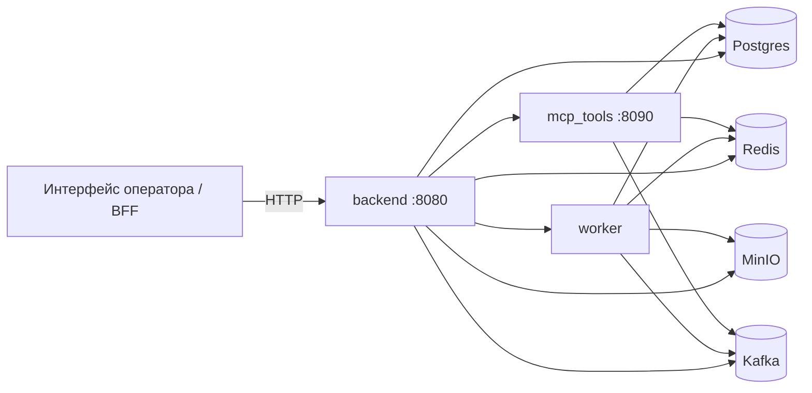
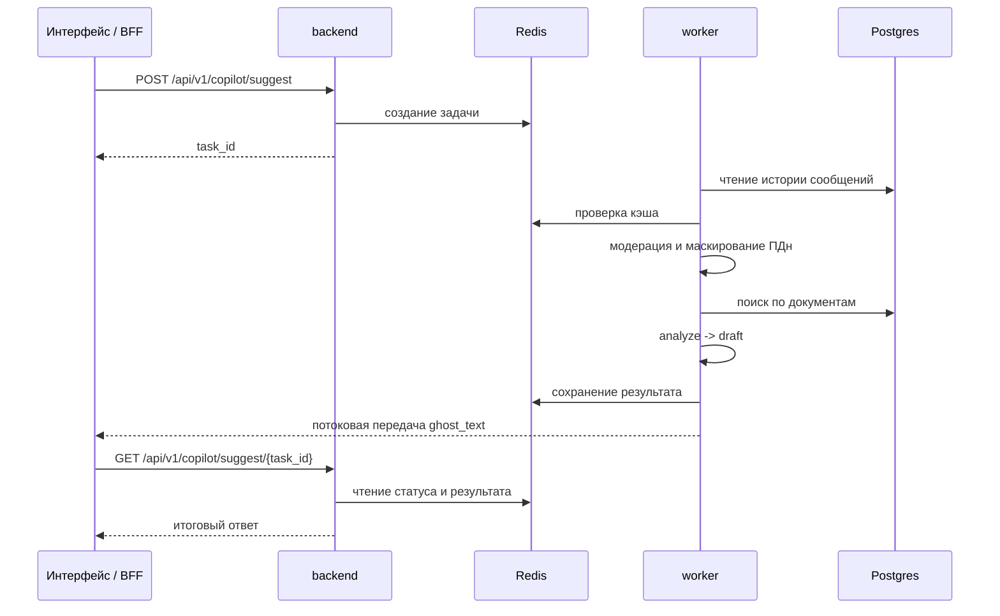
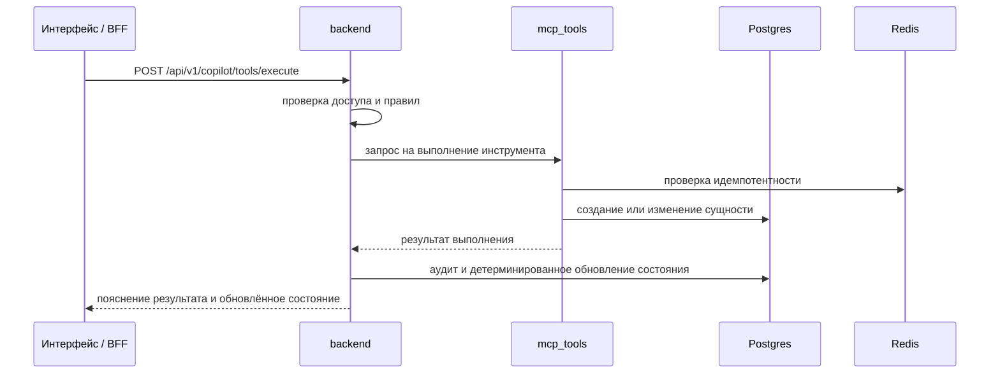

# LLM Copilot для операторской поддержки банка

Серверный контур системы интеллектуальной поддержки оператора при обработке обращений по банковским картам. Проект развёртывается локально, работает в Docker, поддерживает поиск по внутренним регламентам, формирует подсказки оператору, ведёт кейсы и аудит, а подтверждаемые действия выполняет через отдельный сервис инструментов.

## Назначение

Система нужна для сценариев, где оператор должен:

- принять сообщение клиента и сохранить историю диалога;
- понять тип карточного сценария;
- собрать недостающие подтверждения без лишних вопросов;
- опираться на внутренние регламенты и операторские скрипты;
- не запрашивать секреты и не обещать результат, которого ещё нет;
- выполнять действия только после подтверждения и через отдельный инструментальный контур;
- сохранять связность между диалогом, состоянием copilot, кейсом и журналом аудита.

Проект можно использовать как серверную основу для BFF или интерфейса оператора.

## Что реализовано

В текущем состоянии проект поддерживает:

- хранение разговоров и сообщений по `conversation_id`;
- поток событий чата через SSE и WebSocket;
- асинхронное формирование подсказки оператору через `backend + worker`;
- поиск по регламентам и скриптам с возвратом источников;
- загрузку, переиндексацию и начальную загрузку корпуса документов для RAG;
- формирование `ghost_text`, `quick_cards`, `sidebar`, плана шагов и списка допустимых действий;
- детерминированное управление состоянием после выполнения инструмента;
- ведение карточных кейсов, readiness, timeline и dossier;
- отдельный сервис `mcp_tools` с идемпотентностью и строгой валидацией;
- маскирование ПДн, модерацию входа, найденных фрагментов и ответа модели;
- signed service-to-service и signed operator-запросы во внутреннем контуре;
- расширенный аудит с `trace_id`, `state_before`, `state_after`, retrieval snapshot и информацией о кэше;
- воспроизведение и экспорт цепочки событий по `trace_id`.

## Поддерживаемые сценарии

На уровне доменной логики и runtime smoke подтверждены следующие ветки:

- `LostStolen`;
- `SuspiciousTransaction / suspicious`;
- `SuspiciousTransaction / recurring_subscription`;
- `SuspiciousTransaction / duplicate_charge`;
- `SuspiciousTransaction / reversal_pending`;
- `SuspiciousTransaction / merchant_dispute`;
- `CardNotWorking / online`;
- `StatusWhatNext`;
- `UnblockReissue`.

Проект уже не ограничивается одним демонстрационным happy path. В нём есть раздельная логика для спорной операции, утраты карты, повторного списания, холда, подписки, спора с мерчантом, проблем с онлайн-платежами, статуса обращения и разблокировки/перевыпуска.

## Архитектура

Сервисы:

- `backend` — HTTP API, доступ, оркестрация, состояние, кейсы и аудит;
- `worker` — асинхронный конвейер `ANALYZE -> RAG -> DRAFT`;
- `mcp_tools` — выполнение подтверждаемых инструментов;
- `postgres` — разговоры, кейсы, аудит, документы, векторы;
- `redis` — очереди, кэш, статусы задач, потоковые события;
- `minio` — хранение документов;
- `kafka` — event bus.

Ключевой принцип: языковая модель не меняет состояние системы напрямую. Она формирует анализ, черновик и пояснения, а фактическое изменение состояния происходит только после результата инструмента.


## Схема взаимодействия сервисов

### Общая схема



### Формирование подсказки



### Выполнение инструментов



## Структура репозитория

```text
.
├── apps/
│   ├── backend/
│   ├── worker/
│   └── mcp_tools/
├── libs/
│   └── common/
├── packages/
│   └── contracts/
├── migrations/
├── docs/
│   ├── rag_corpus/
│   └── eval/
├── tests/
├── scripts/
├── docker-compose.yml
├── requirements.txt
├── Makefile
└── .env.example
```

Назначение основных частей:

- `apps/` — исполняемые сервисы;
- `libs/common/` — общая доменная и инфраструктурная логика;
- `packages/contracts/` — схемы и контракты Pydantic;
- `docs/rag_corpus/` — начальный корпус регламентов и скриптов;
- `docs/eval/` — артефакты оценки retrieval;
- `tests/` — unit и runtime-oriented тесты.

## Технологический стек

- Python 3.11;
- FastAPI;
- SQLAlchemy 2 + asyncpg;
- PostgreSQL + pgvector;
- Redis;
- MinIO;
- Kafka / Redpanda;
- Alembic;
- Pydantic v2;
- Docker / Docker Compose.

Режимы LLM и эмбеддингов:

- `stub` — детерминированный режим для локальной разработки и тестов;
- `openai_compat` — совместимый внешний провайдер;
- `contracts_http` — внешний HTTP-адаптер для контрактных JSON-ответов.

## Быстрый запуск

### Требования

Нужны:

- Docker и Docker Compose;
- свободные порты:
  - `8080` — backend;
  - `8090` — `mcp_tools`;
  - `5432` — PostgreSQL;
  - `6379` — Redis;
  - `9000` / `9001` — MinIO и консоль MinIO;
  - `19092` / `19644` — Kafka/Redpanda.

### Запуск

```bash
cp .env.example .env
docker compose up -d --build
```

Миграции применяются сервисом `migrate` до старта `backend`, `worker` и `mcp_tools`.

### Базовая проверка

```bash
curl http://localhost:8080/health
curl http://localhost:8080/readiness
curl http://localhost:8090/health
curl http://localhost:8090/readiness
docker compose ps
```

## Конфигурация

Основные переменные задаются через `.env`. Ключевые группы:

- инфраструктура: `DATABASE_URL`, `REDIS_URL`, `MINIO_*`, `KAFKA_*`;
- внешний сервис инструментов: `MCP_TOOLS_URL`;
- модели: `LLM_PROVIDER`, `LLM_BASE_URL`, `LLM_*_MODEL`, `LLM_API_KEY`;
- эмбеддинги: `EMBED_PROVIDER`, `EMBED_BASE_URL`, `EMBED_MODEL`;
- RAG: `RAG_SEED_DIR`;
- внутренний доступ: `INTERNAL_AUTH_*`.

Важно:

- не храните рабочие `LLM_API_KEY` и production-секреты в репозитории;
- `INTERNAL_AUTH_SIGNING_KEY` должен быть длинным случайным секретом;
- после `docker compose down -v` требуется заново загрузить начальный корпус документов.

## Корпус знаний и RAG

В `docs/rag_corpus/` лежит стартовый набор документов по карточным сценариям:

- спорные операции и подозрительные списания;
- блокировка карты, утрата и кража;
- подписки и merchant dispute;
- статусы кейсов и эскалация;
- информационная безопасность;
- операторские скрипты.

Поддерживаются:

- загрузка `docx`, `pdf`, `txt`;
- bootstrap начального корпуса;
- автоматическая переиндексация;
- расширенные метаданные фрагментов;
- планировщик запроса и дополнительное ранжирование;
- отдельный набор оценки retrieval в `docs/eval/`.

Запуск оценки retrieval:

```bash
PYTHONPATH=packages/contracts/src:. python scripts/eval_rag.py
```

## Модель доступа и доверия

### Общий принцип

Браузер или внешний клиент не считаются доверенной стороной. `backend` и `mcp_tools` ждут signed internal headers с контекстом субъекта.

### Основные заголовки

Используются:

- `X-Internal-Claims`;
- `X-Internal-Signature`;
- `X-Request-Id`;
- `X-Actor-Role`;
- `X-Actor-Id`;
- при необходимости `X-Origin-Actor-Role` и `X-Origin-Actor-Id`.

В проекте есть helper `build_internal_headers(...)` в `libs/common/internal_auth.py`, который формирует корректный набор заголовков.

### Роли

Поддерживаются две роли:

- `operator` — основной субъект для пользовательских и операторских действий;
- `service` — межсервисный субъект внутри доверенного контура.

### Что важно учитывать

- защищённые backend-endpoint без signed headers возвращают `401`;
- direct-вызов `mcp_tools /api/v1/tools/execute` требует `actor_role=operator`, а вызов с `service`-заголовками возвращает `403`;
- `POST /api/v1/copilot/tools/execute` в backend требует уже построенный `copilot state` для `conversation_id`, иначе возвращает `409`;
- reuse одного `idempotency_key` в `mcp_tools` с другими `params` возвращает `409`.

## API: backend

### Что видно в публичной OpenAPI-схеме

Backend публикует OpenAPI только для основного пользовательского контура.

#### Диалоги

- `POST /api/v1/chat/conversations`
- `GET /api/v1/chat/conversations/{conversation_id}/messages`
- `POST /api/v1/chat/conversations/{conversation_id}/messages`
- `GET /api/v1/chat/stream`
- `GET /api/v1/chat/ws` (WebSocket)

#### Copilot

- `POST /api/v1/copilot/suggest`
- `GET /api/v1/copilot/suggest/{task_id}`
- `POST /api/v1/copilot/suggest/{task_id}/cancel`
- `GET /api/v1/copilot/suggest/{task_id}/stream`
- `GET /api/v1/copilot/state`
- `POST /api/v1/copilot/tools/execute`
- `POST /api/v1/copilot/profile/confirm`

#### Кейсы

- `GET /api/v1/cases`
- `GET /api/v1/cases/{case_id}`
- `GET /api/v1/cases/{case_id}/dossier`
- `PATCH /api/v1/cases/{case_id}`
- `GET /api/v1/cases/{case_id}/timeline`

#### Технические проверки

- `GET /health`
- `GET /readiness`

### Скрытые backend-endpoint, исключённые из публичной схемы

Они доступны в коде и runtime, но помечены как `include_in_schema=False`.

#### Документы

- `POST /api/v1/docs/upload`
- `POST /api/v1/docs/bootstrap-seed`
- `POST /api/v1/docs/reindex`
- `GET /api/v1/docs`
- `GET /api/v1/docs/{doc_id}`
- `GET /api/v1/docs/{doc_id}/chunks`

#### Поиск

- `POST /api/v1/rag/search`

#### Аудит и воспроизведение

- `GET /api/v1/audit`
- `GET /api/v1/audit/trace/{trace_id}`
- `GET /api/v1/audit/trace/{trace_id}/replay`
- `GET /api/v1/audit/trace/{trace_id}/export`

#### Внутренние service-to-service endpoint

- `POST /api/v1/_internal/cases/create`
- `GET /api/v1/_internal/cases/status`

Эти маршруты предназначены для доверенного контура и не должны торчать наружу без промежуточного слоя доступа.

## API: `mcp_tools`

Сервис публикует отдельную OpenAPI-схему и отвечает на:

- `POST /api/v1/tools/execute`
- `GET /health`
- `GET /readiness`

Поддерживаемые инструменты:

- `create_case`
- `get_case_status`
- `get_transactions`
- `block_card`
- `unblock_card`
- `reissue_card`
- `get_card_limits`
- `set_card_limits`
- `toggle_online_payments`

Часть инструментов сейчас остаётся `mock`, но вызовы, валидация и идемпотентность уже живут как отдельный сервисный контракт.

## Типовой сценарий работы через API

1. Создать разговор: `POST /api/v1/chat/conversations`.
2. Добавить сообщение: `POST /api/v1/chat/conversations/{conversation_id}/messages`.
3. Построить подсказку: `POST /api/v1/copilot/suggest`.
4. Получить состояние задачи:
   - polling через `GET /api/v1/copilot/suggest/{task_id}`;
   - или stream через `GET /api/v1/copilot/suggest/{task_id}/stream`.
5. Получить текущее состояние диалога: `GET /api/v1/copilot/state`.
6. Выполнить разрешённый инструмент: `POST /api/v1/copilot/tools/execute`.
7. Получить кейс, dossier, timeline и аудит.

## Проверенные runtime smoke и endpoint smoke

На локальном Docker-контуре подтверждены:

### Бизнес-сценарии

- `LostStolen` и смешанный high-risk сценарий с компрометацией;
- `recurring_subscription`;
- `duplicate_charge`;
- `reversal_pending`;
- `merchant_dispute`;
- `CardNotWorking / online`;
- `StatusWhatNext`;
- `UnblockReissue`.

### Потоковые каналы

- `GET /api/v1/copilot/suggest/{task_id}/stream`;
- `GET /api/v1/chat/stream`;
- `GET /api/v1/chat/ws`.

### Endpoint-проверки

Подтверждены:

- `GET /health` и `GET /readiness` для backend и `mcp_tools`;
- OpenAPI-схема backend и `mcp_tools`;
- `GET /api/v1/cases`;
- `GET /api/v1/audit`;
- direct `POST /api/v1/tools/execute` в `mcp_tools`;
- `401` на backend protected endpoint без internal auth;
- `403` на direct `mcp_tools` при вызове от имени `service` вместо `operator`;
- `409` на reuse `idempotency_key` с другими параметрами;
- `422` на некорректный payload.

## Тесты

Текущее состояние набора тестов:

- `101` тест проходят локально;
- покрыты stream-контракты, auth, idempotency, readiness, dossier, runtime bridge, stabilisation draft, RAG и доменная матрица сценариев.

Локальный запуск:

```bash
python -m venv .venv
source .venv/bin/activate
pip install -r requirements.txt
PYTHONPATH=packages/contracts/src:. python -m pytest -q
```

Синтаксическая проверка:

```bash
python -m compileall apps libs packages/contracts/src tests
```

## Команды разработки

```bash
make up
make down
make reset
make logs
make ps
make migrate
make rebuild
make test
make lint
```

## Ограничения текущей версии

Проект уже рабочий, но в нём ещё остаются зоны для доводки:

- retrieval по источникам местами шумный и требует дополнительной настройки под intent;
- часть инструментов реализована как `mock`;
- формулировки `ghost_text` и explain ещё можно полировать;
- для действительно неоднозначных формулировок полезно добавить дополнительный bounded fallback-слой поверх основного `ANALYZE`, но не вместо детерминированных правил.

## Дальнейшее развитие

Логичные направления следующего этапа:

- улучшение retrieval по доменным сценариям;
- дополнительная полировка операторских текстов;
- расширение карты кейсов и доменных признаков;
- развитие итогового dossier;
- усиление автоматизированных runtime smoke до отдельного скрипта матрицы сценариев;
- подготовка внешнего BFF или интерфейса оператора поверх текущего серверного контура.

## Итог

Это уже не просто демонстрационный MVP, который умеет один сценарий. Проект представляет собой рабочий локальный серверный стенд операторского copilot-решения с RAG, фоновым worker, отдельным сервисом инструментов, кейсами, dossier, аудитом, signed internal access и проверенным endpoint-контуром.
