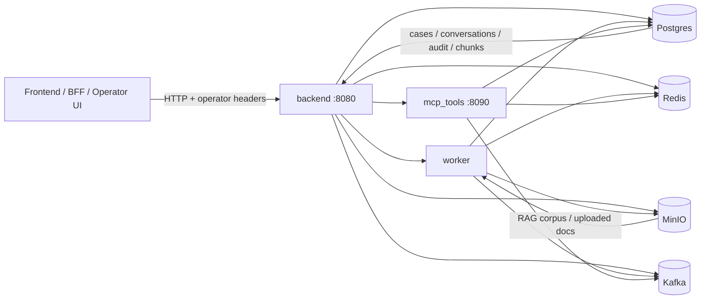
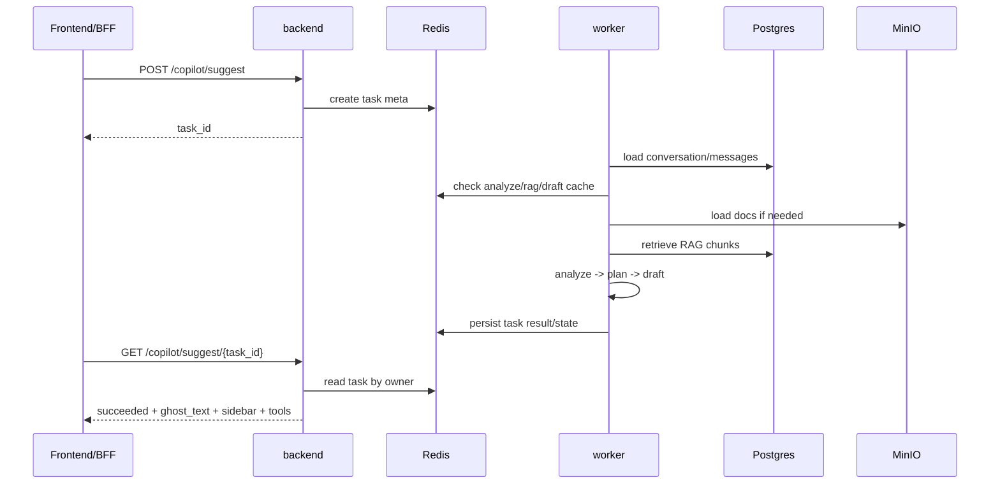
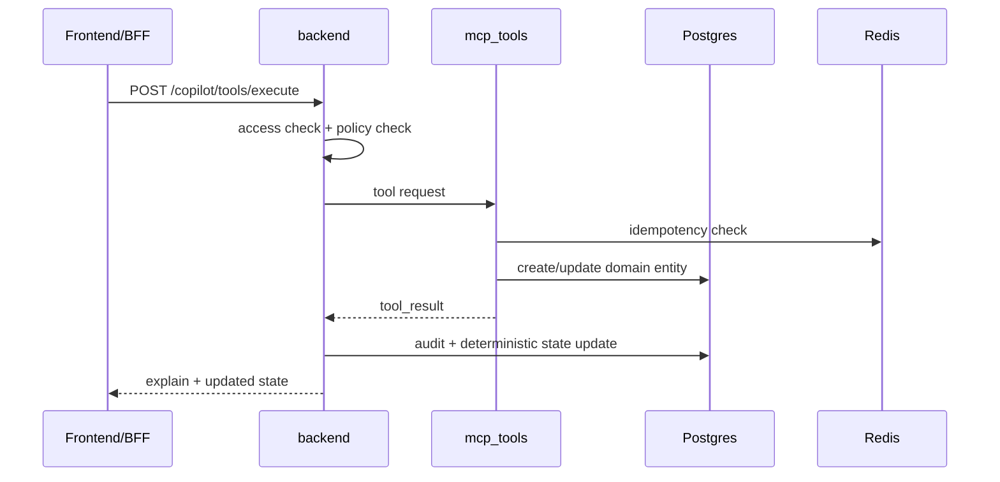
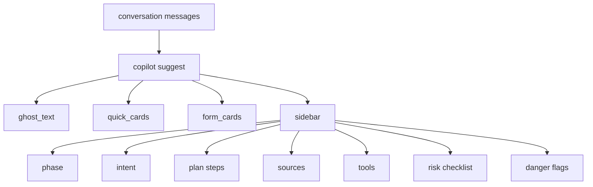

# LLM Copilot MVP

MVP-платформа операторского copilot-сценария для карточных обращений: подозрительные списания, блокировка карты, создание обращения, audit trail и retrieval по внутренним регламентам. Проект задуман как **локальный dev-стенд и понятный backend-контур**, на который можно быстро навесить BFF или frontend-UI без долгого раскопа чужих инженерных привычек.

> Если коротко: это backend для операторского copilot-а, который помогает оператору не импровизировать на банковские темы, а действовать по регламенту, с RAG, tool-driven flow и контролируемым state.

---

## 1. Что это за продукт и зачем он нужен

### Проблема
Оператор карточной поддержки работает в сценариях, где легко ошибиться:
- можно упустить обязательное уточнение;
- можно нарушить ограничения по ПДн и социнжинирингу;
- можно перепутать сценарии: dispute, lost/stolen, duplicate, recurring payment;
- можно сказать клиенту то, чего система ещё не сделала;
- можно потерять связность между диалогом, кейсом, tool execution и audit.

### Что делает LLM Copilot MVP
Система помогает оператору вести диалог и принимать действия **не “по вдохновению”, а по контролируемому pipeline**:
- анализирует последнее сообщение клиента;
- поднимает релевантные куски регламентов из RAG;
- строит suggestion для оператора: `ghost_text`, quick cards, form cards, sidebar;
- показывает допустимые действия (`tools`) по текущему состоянию сценария;
- выполняет инструменты через отдельный сервис;
- пишет аудит и сохраняет объектное состояние.

### Для кого проект
Проект полезен, если нужно:
- быстро поднять локальный backend-контур copilot-а;
- дать фронту понятный API и структуру state;
- показать MVP-логику на демо/защите;
- тестировать операторские сценарии через `curl`, BFF или UI;
- иметь seed-корпус документов для RAG “из коробки”.

### Что это **не** делает
Это не готовый prod-банк. Это **MVP/dev-стенд** с правильной логикой границ, ролей и сценариев, который можно развивать дальше.

---

## 2. Что уже умеет система

- ведёт диалоги по `conversation_id`;
- создаёт task-based copilot suggestions;
- хранит и отдаёт `copilot state` по разговору;
- запускает инструменты через отдельный `mcp_tools` сервис;
- создаёт кейсы и ведёт `audit trail`;
- индексирует документы в RAG и ищет по ним;
- различает `policy / security / script` источники;
- ограничивает доступ на уровне `conversation`, `case`, `task`;
- поддерживает `safe mode` для рискованных входов;
- использует детерминированный update state после `tool_result`;
- поддерживает `docx / pdf / txt` ingest;
- поставляется с seed-корпусом документов в `docs/rag_corpus/`.

---

## 3. Архитектурная идея

Проект построен как набор отдельных сервисов с общей контрактной и инфраструктурной базой:
- `backend` — внешний HTTP API и оркестрация;
- `worker` — async pipeline suggest/analyze/draft;
- `mcp_tools` — исполнение tool actions;
- `postgres` — основное состояние;
- `redis` — кэш, task state, idempotency;
- `minio` — хранение документов;
- `kafka` — event-bus слой.

### Ключевой принцип
**LLM не должна напрямую менять факт выполнения действий.**
Фактическое состояние изменяется только после реального `tool_result`, а не потому что модель решила звучать слишком уверенно. Да, для банковских сценариев это полезно. Кто бы мог подумать.

---

## 4. Схема сервисов

> GitHub нормально рендерит `mermaid`, так что эти схемы можно держать прямо в `README.md`.

### 4.1 Общая топология



### 4.2 Pipeline `suggest`



### 4.3 Pipeline `tool execution`



### 4.4 Что видит фронт



---

## 5. Структура репозитория

```text
.
├── apps/
│   ├── backend/               # FastAPI backend
│   │   └── app/
│   │       ├── api/v1/routes/ # внешние и внутренние HTTP-ручки
│   │       └── core/          # access, deps, audit, bus, state helpers
│   ├── worker/                # async suggest / analyze / draft pipeline
│   └── mcp_tools/             # tool execution service
├── libs/
│   └── common/                # db, rag, llm, models, kafka, security, utils
├── packages/
│   └── contracts/             # pydantic contracts / shared schemas
├── docs/
│   ├── rag_corpus/            # seed corpus для RAG
│   └── *.md                   # архитектурные и служебные документы
├── tests/                     # unit/smoke tests
├── docker-compose.yml         # локальный dev-стенд
├── requirements.txt
├── Makefile
└── .env.example
```

Смысл раскладки простой:
- `apps/` содержит исполняемые сервисы;
- `libs/common/` хранит общий код;
- `packages/contracts/` отделяет контракты;
- `docs/rag_corpus/` содержит стартовую базу знаний.

То есть уже видно, где продукт, где инфраструктура, а где бумажная бюрократия для retrieval.

---

## 6. Быстрый старт

### 6.1 Требования

Нужны:
- Docker + Docker Compose;
- свободные порты `8080`, `8090`, `5432`, `6379`, `9000`, `9001`, `9092`;
- локальный `.env` на основе `.env.example`.

### 6.2 Поднять стек

Linux/macOS:

```bash
cp .env.example .env
docker compose up -d --build
```

Windows CMD:

```cmd
copy .env.example .env
docker compose up -d --build
```

### 6.3 Проверить, что всё живо

```bash
curl http://localhost:8080/health
curl http://localhost:8090/health
docker compose ps
```

Ожидаемый ответ для health:

```json
{"ok":true}
```

---

## 7. Важно про данные

В `docker-compose.yml` используются named volumes:
- `postgres_data`
- `redis_data`
- `minio_data`

Поэтому:
- `docker compose down` удаляет контейнеры, но сохраняет данные;
- `docker compose down -v` удаляет контейнеры и volumes, то есть делает полную зачистку.

Это важно. Иначе потом начинаются трагические рассказы о том, что “данные почему-то исчезли сами”.

---

## 8. Быстрый smoke-test

### 8.1 Заголовки operator-запросов

Windows CMD:

```cmd
set TOKEN=dev-internal-token
set ROLE=operator
set AID=op-1
```

### 8.2 Загрузить seed-корпус в RAG

```bash
curl -s -X POST "http://localhost:8080/api/v1/docs/bootstrap-seed" \
  -H "X-Internal-Auth: dev-internal-token" \
  -H "X-Actor-Role: operator" \
  -H "X-Actor-Id: op-1"
```

### 8.3 Проверить RAG-поиск

```bash
curl -s -X POST "http://localhost:8080/api/v1/rag/search" \
  -H "X-Internal-Auth: dev-internal-token" \
  -H "X-Actor-Role: operator" \
  -H "X-Actor-Id: op-1" \
  -H "Content-Type: application/json" \
  --data '{"query":"клиент сообщил код из SMS и просит заблокировать карту","top_k":5}'
```

### 8.4 Создать разговор

```bash
curl -s -X POST "http://localhost:8080/api/v1/chat/conversations" \
  -H "X-Internal-Auth: dev-internal-token" \
  -H "X-Actor-Role: operator" \
  -H "X-Actor-Id: op-1"
```

### 8.5 Запустить suggest

1. создать conversation;
2. отправить сообщение;
3. вызвать `POST /api/v1/copilot/suggest`;
4. получить `task_id`;
5. читать `GET /api/v1/copilot/suggest/{task_id}`.

### 8.6 Проверить tool execution

Базовый happy-path:
- `create_case`
- `block_card`
- `cases?conversation_id=...`
- `audit?conversation_id=...`

---

## 9. Seed-корпус RAG

Проект уже содержит стартовый корпус документов:

- `REG-DSP-001` — оспаривание операций;
- `REG-BLK-002` — блокировка карты;
- `REG-SEC-003` — ПДн и социнжиниринг;
- `REG-TRX-004` — отложенные и дублированные списания;
- `REG-LST-005` — утеря / кража / компрометация;
- `REG-SUB-006` — подписки и recurring payments;
- `REG-ESC-007` — антифрод-эскалация;
- `REG-STS-008` — статусы кейсов и коммуникация;
- `REG-FBK-009` — fallback при недоступности инструментов;
- `SCRIPT-OPS-001`, `SCRIPT-OPS-002` — скриптовый слой для draft.

### Как работает retrieval

- из документов извлекаются `doc_code`, `source_type`, `version_label`, `effective_date`;
- служебная шапка не лезет в индекс как полезное знание;
- `security/policy` получают больший вес, чем `script`;
- похожие куски не забивают top-k;
- один и тот же retriever используется и для `/rag/search`, и для worker.

---

## 10. Как фронту подключаться к copilot

### Базовая идея
Фронт может уже сейчас навешивать UI на backend через HTTP.
Для локальной разработки достаточно ходить в:

- `http://localhost:8080` — backend
- `http://localhost:8090` — mcp_tools, если нужен отдельный сервисный дебаг

Но нормальная схема для продукта такая:
- UI → BFF → backend
- прямой доступ браузера к внутренним маршрутам лучше не превращать в привычку.

### Обязательные заголовки
Операторские запросы должны идти с:
- `X-Internal-Auth`
- `X-Actor-Role`
- `X-Actor-Id`

### Основные ручки, которые нужны фронту

#### Диалоги
- `POST /api/v1/chat/conversations`
- `POST /api/v1/chat/conversations/{conversation_id}/messages`

#### Copilot
- `POST /api/v1/copilot/suggest`
- `GET /api/v1/copilot/suggest/{task_id}`
- `GET /api/v1/copilot/state?conversation_id=...`
- `POST /api/v1/copilot/tools/execute`

#### Кейсы и аудит
- `GET /api/v1/cases?conversation_id=...`
- `GET /api/v1/audit?conversation_id=...`

#### Документы и RAG
- `POST /api/v1/docs/bootstrap-seed`
- `GET /api/v1/docs`
- `POST /api/v1/rag/search`

---

## 11. Что именно фронт может рендерить

Минимальный UI для operator copilot-а можно строить так.

### Левая колонка
- список разговоров;
- текущая лента сообщений;
- поле ввода оператора.

### Центральная панель
- `ghost_text`;
- quick cards;
- form cards;
- draft suggestions.

### Правая панель
Рендерить из `sidebar`:
- `phase`
- `intent`
- `plan.steps`
- `sources`
- `tools`
- `risk_checklist`
- `danger_flags`

### Action bar
Кнопки строить из `result.sidebar.tools`:
- `create_case`
- `block_card`
- `get_transactions`
- `reissue_card`

Важно: фронт должен уважать `enabled/reason`, а не придумывать доступность действий сам. Иначе backend скажет “tool disabled”, а UI будет делать вид, что всё можно. Как обычно, самая слабая часть системы часто сидит ближе всего к пользователю.

---

## 12. Типовой UI-flow для фронта

### Flow: suggest
1. оператор пишет сообщение;
2. фронт вызывает `POST /copilot/suggest`;
3. получает `task_id`;
4. поллит `GET /copilot/suggest/{task_id}`;
5. когда task `succeeded`, рендерит:
   - `ghost_text`
   - `quick_cards`
   - `form_cards`
   - `sidebar`

### Flow: tool execution
1. фронт берёт `tool` из `sidebar.tools`;
2. проверяет `enabled`;
3. вызывает `POST /copilot/tools/execute`;
4. показывает `explain.ghost_text`;
5. при необходимости обновляет `cases`, `audit`, `copilot state`.

---

## 13. Переменные окружения

Все реальные ключи и секреты должны жить только в локальном `.env`.

Ключевые переменные:
- `INTERNAL_AUTH_TOKEN`
- `DATABASE_URL`
- `REDIS_URL`
- `MINIO_ENDPOINT`
- `MINIO_ACCESS_KEY`
- `MINIO_SECRET_KEY`
- `MINIO_BUCKET`
- `LLM_PROVIDER`
- `LLM_BASE_URL`
- `LLM_API_KEY`
- `LLM_ANALYZE_MODEL`
- `LLM_DRAFT_MODEL`
- `LLM_EXPLAIN_MODEL`
- `LLM_GHOST_MODEL`
- `EMBED_PROVIDER`
- `EMBED_BASE_URL`
- `EMBED_MODEL`
- `RAG_SEED_DIR`

---

## 14. Роли и доступ

### `operator`
Операторский UI и copilot-flow.

### `service`
Только внутренние service-to-service вызовы.

### Object-level access
Проверяется для:
- `conversation`
- `case`
- `task`

Это значит, что оператор не должен видеть чужой `task_id`, даже если кто-то зачем-то решил им поделиться.

---

## 15. Безопасность и ограничения

- task-based endpoints проверяют владельца задачи;
- внутренние `/api/v1/_internal/*` доступны только роли `service`;
- `tool_result` не может произвольно перезаписать `phase/plan`;
- safe mode режет опасный контекст;
- audit хранит фактическую последовательность событий;
- чувствительные действия должны подтверждаться реальным `tool_result`, а не красивым текстом модели.

---

## 16. Команды разработки

```bash
make up
make down
make reset
make logs
make ps
make test
make lint
```

Если `make` на машине нет, используй прямые команды `docker compose` и `pytest`.

### Локальный запуск тестов без Docker

Linux/macOS:

```bash
python -m venv .venv
source .venv/bin/activate
pip install -r requirements.txt
python -m pytest -q
```

Windows CMD:

```cmd
python -m venv .venv
.venv\Scripts\activate
pip install -r requirements.txt
python -m pytest -q
```

---

## 17. Диагностика

Полезные команды:

```bash
docker compose logs --tail=100 backend
docker compose logs --tail=100 worker
docker compose logs --tail=100 mcp-tools
docker compose logs --tail=100 postgres
docker compose logs --tail=100 redis
docker compose logs --tail=100 kafka
```

Очистить Redis-кэш:

```bash
docker compose exec redis redis-cli FLUSHDB
```

Полностью снести стек с данными:

```bash
docker compose down -v
```

---

## 18. Что не надо коммитить и паковать

Не включай в репозиторий и архивы:
- `.env`
- `.git`
- `__pycache__`
- `.pytest_cache`
- локальные дампы
- временные build artifacts

Иначе потом снова окажется, что секреты “как-то сами” попали в архив. Разумеется. Они же очень любят путешествовать без спроса.

---

## 19. Итог

`LLM Copilot MVP` — это не просто набор сервисов, а уже рабочий backend-контур операторского copilot-а, на который можно:
- поднять локальный dev-стенд;
- навесить frontend;
- гонять сценарии через API;
- тестировать tool-driven flow;
- развивать product logic дальше.

Если тебе нужен репозиторий, который можно спокойно клонировать, поднять и начать интегрировать с UI без недельного гадания, что тут вообще происходит, то README должен быть именно таким: прямым, подробным и не надеющимся на телепатию следующего человека.
