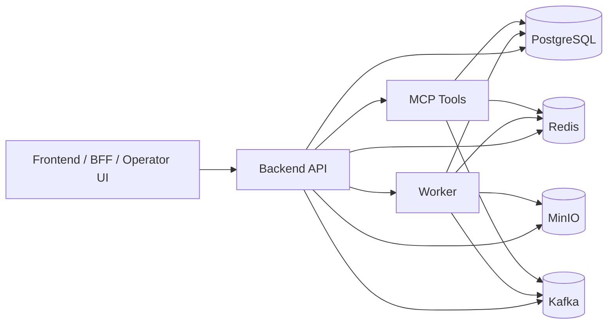

# LLM Copilot for Bank Card Dispute Handling

Backend MVP системы класса LLM Copilot для поддержки оператора банка при обработке обращений, связанных со спорными операциями по платежным картам. Проект реализует сценарии анализа диалога, поиска по внутренним регламентам, формирования подсказок оператору, выполнения инструментальных действий через выделенный сервис и ведения аудита.

## Overview

Система предназначена для поддержки оператора в сценариях, где требуется соблюдать регламент, последовательно собирать обязательные сведения и исключать неподтвержденные действия. Основная задача проекта состоит в том, чтобы помочь оператору вести обработку обращения в управляемом процессе, а не полагаться на неформальные шаблоны ответа.

Проект ориентирован на локальную разработку, демонстрацию архитектурного подхода и интеграцию с внешним BFF или пользовательским интерфейсом. Он не является production-решением, но закладывает основу для дальнейшего развития в сторону промышленной системы.

## Problem Statement

При обработке карточных обращений оператор работает в условиях, где критичны точность, последовательность и соблюдение требований безопасности. В подобных сценариях необходимо:

- корректно различать тип обращения;
- не пропускать обязательные уточнения;
- не выполнять действия без подтверждения;
- учитывать ограничения, связанные с персональными данными и антифрод-процедурами;
- сохранять связность между диалогом, кейсом, инструментальными действиями и аудитом.

## Project Goals

Проект решает следующие задачи:

- хранение истории диалога и связанных артефактов;
- поиск релевантных фрагментов регламентов и скриптов с использованием RAG;
- формирование структурированных подсказок оператору;
- отображение допустимых действий в зависимости от текущего состояния сценария;
- выполнение подтвержденных инструментальных действий через отдельный сервис;
- ведение аудита по ключевым операциям и изменениям состояния.

## Core Capabilities

На текущем этапе система поддерживает:

- ведение диалогов по `conversation_id`;
- асинхронное формирование copilot-подсказок по `task_id`;
- хранение и выдачу состояния copilot по диалогу;
- поиск по документам и индексированному RAG-корпусу;
- выполнение tool-вызовов через отдельный сервис `mcp_tools`;
- создание кейсов и ведение `audit trail`;
- разграничение доступа на уровне `conversation`, `case` и `task`;
- обработку документов форматов `docx`, `pdf`, `txt`;
- использование seed-корпуса документов для локального запуска и демонстрации.

## Architecture

Проект построен как многокомпонентный backend-контур с разделением ответственности между сервисами:

- `backend` — внешний HTTP API и оркестрация сценариев;
- `worker` — асинхронная обработка цепочек `analyze -> rag -> draft`;
- `mcp_tools` — выполнение инструментальных действий;
- `PostgreSQL` — основное хранилище данных;
- `Redis` — кэш, статусы задач, временное состояние;
- `MinIO` — хранение документов;
- `Kafka` — шина событий и аудит.

### Key Principle

Языковая модель не изменяет фактическое состояние системы напрямую. Изменения, влияющие на обслуживание клиента, фиксируются только после подтвержденного и успешно выполненного `tool_result`. Такой подход позволяет отделить рекомендации модели от фактических действий системы.

### High-Level Diagram



## Suggestion Pipeline

Сценарий формирования подсказки оператору включает следующие этапы:

1. получение контекста диалога;
2. анализ последнего сообщения клиента;
3. поиск релевантных регламентов через RAG;
4. генерацию структурированного ответа для UI;
5. сохранение результата и состояния задачи.

Результат подсказки может включать:

- `ghost_text`;
- `quick_cards`;
- `form_cards`;
- `sidebar` с текущей фазой, намерением, источниками, инструментами и рисковыми флагами.

## Tool Execution Flow

Инструментальные действия выполняются только после явного подтверждения оператора. Backend проверяет допустимость действия в текущем состоянии сценария, передает запрос в `mcp_tools`, а затем обновляет состояние и аудит на основании фактического результата.

Примеры поддерживаемых действий:

- `create_case`
- `get_case_status`
- `get_transactions`
- `block_card`
- `unblock_card`
- `reissue_card`
- `get_card_limits`
- `set_card_limits`
- `toggle_online_payments`

## Repository Structure

```text
.
├── apps/                      # прикладные компоненты и точки входа
├── docs/                      # документация и seed-корпус для RAG
├── libs/                      # общие библиотеки и инфраструктурный код
├── packages/
│   └── contracts/             # общие контракты и схемы
├── services/                  # backend, worker, mcp_tools
├── shared/                    # общий код и переиспользуемые модули
├── tests/                     # unit и smoke tests
├── .env.example               # шаблон переменных окружения
├── docker-compose.yml         # локальный стенд
├── Makefile                   # команды управления проектом
└── requirements.txt
```

## Technology Stack

- Python
- FastAPI
- PostgreSQL
- Redis
- MinIO
- Kafka
- Docker Compose
- RAG / embeddings pipeline
- LLM API integration

## Quick Start

### Requirements

Для локального запуска необходимы:

- Docker
- Docker Compose
- свободные порты для сервисов из `docker-compose.yml`

### Run

Linux/macOS:

```bash
cp .env.example .env
docker compose up -d --build
```

Windows CMD:

```cmd
copy .env.example .env
docker compose up -d --build
```

### Health Check

```bash
curl http://localhost:8080/health
curl http://localhost:8090/health
docker compose ps
```

Ожидаемый ответ:

```json
{"ok": true}
```

## Example Workflow

Базовый сценарий использования:

1. создать диалог;
2. добавить сообщение клиента;
3. вызвать `POST /api/v1/copilot/suggest`;
4. получить `task_id`;
5. запросить результат по `GET /api/v1/copilot/suggest/{task_id}`;
6. отобразить подсказки оператору;
7. при необходимости выполнить подтвержденный tool-вызов;
8. получить обновленное состояние и запись в аудите.

## Frontend and BFF Integration

Проект изначально рассчитан на интеграцию с внешним пользовательским интерфейсом. Backend предоставляет API, на которое может быть навешан как промежуточный BFF-слой, так и полноценный operator UI.

Рекомендуемая схема интеграции:

- `UI -> BFF -> backend`

Такой подход позволяет централизовать авторизацию, преобразование контрактов и серверную агрегацию данных. Для локальной разработки допустимо обращаться к backend напрямую, однако в прикладной архитектуре предпочтителен BFF-слой.

### Required Headers

Для операторских запросов используются следующие заголовки:

- `X-Internal-Auth`
- `X-Actor-Role`
- `X-Actor-Id`

### Main Endpoints for Frontend

#### Chat

- `POST /api/v1/chat/conversations`
- `POST /api/v1/chat/conversations/{conversation_id}/messages`

#### Copilot

- `POST /api/v1/copilot/suggest`
- `GET /api/v1/copilot/suggest/{task_id}`
- `GET /api/v1/copilot/state?conversation_id=...`
- `POST /api/v1/copilot/tools/execute`

#### Cases and Audit

- `GET /api/v1/cases?conversation_id=...`
- `GET /api/v1/audit?conversation_id=...`

#### Documents and RAG

- `POST /api/v1/docs/bootstrap-seed`
- `GET /api/v1/docs`
- `POST /api/v1/rag/search`

## UI Rendering Model

Минимальный интерфейс оператора может быть построен вокруг следующих блоков.

### Left Panel

- список диалогов;
- история сообщений;
- поле ввода оператора.

### Central Panel

- `ghost_text`;
- `quick_cards`;
- `form_cards`;
- `draft suggestions`.

### Right Panel

Данные из `sidebar` могут использоваться для отображения:

- текущей фазы сценария;
- определенного намерения клиента;
- плана действий;
- источников, использованных при формировании ответа;
- доступных инструментов;
- чек-листа рисков;
- предупреждающих флагов.

### Action Bar

Панель действий должна строиться на основе списка инструментов, полученного от backend. Доступность действий должна определяться сервером, а не клиентской логикой интерфейса.

## Typical Frontend Flow

### Suggest Flow

1. оператор отправляет сообщение;
2. frontend вызывает `POST /api/v1/copilot/suggest`;
3. backend возвращает `task_id`;
4. frontend запрашивает `GET /api/v1/copilot/suggest/{task_id}`;
5. после завершения задачи интерфейс отображает `ghost_text`, `quick_cards`, `form_cards` и `sidebar`.

### Tool Execution Flow

1. frontend получает доступные действия из `sidebar.tools`;
2. пользователь подтверждает запуск инструмента;
3. frontend вызывает `POST /api/v1/copilot/tools/execute`;
4. backend возвращает обновленное состояние, пояснение и данные для повторного рендера.

## Security and Operational Constraints

Проект учитывает ряд ограничений, характерных для банковских сценариев:

- чувствительные действия не выполняются автоматически;
- права доступа проверяются на уровне объектов и задач;
- внутренние вызовы отделены от внешнего интерфейса;
- результаты модели не считаются фактом до подтвержденного действия;
- аудит фиксирует ключевые события и изменения состояния;
- структура ответа модели ориентирована на серверную валидацию и предсказуемую интеграцию с UI.

## Development Commands

```bash
make up
make down
make reset
make logs
make ps
make test
make lint
```

Если `make` недоступен, можно использовать прямые команды `docker compose` и `pytest`.

## Testing Without Docker

Linux/macOS:

```bash
python -m venv .venv
source .venv/bin/activate
pip install -r requirements.txt
python -m pytest -q
```

Windows CMD:

```cmd
python -m venv .venv
.venv\Scripts\activate
pip install -r requirements.txt
python -m pytest -q
```

## Environment Variables

Ключевые параметры окружения задаются локально через `.env` на основе `.env.example`.

Примеры:

- `INTERNAL_AUTH_TOKEN`
- `DATABASE_URL`
- `REDIS_URL`
- `MINIO_ENDPOINT`
- `MINIO_ACCESS_KEY`
- `MINIO_SECRET_KEY`
- `MINIO_BUCKET`
- `LLM_PROVIDER`
- `LLM_BASE_URL`
- `LLM_API_KEY`
- `LLM_ANALYZE_MODEL`
- `LLM_DRAFT_MODEL`
- `LLM_EXPLAIN_MODEL`
- `LLM_GHOST_MODEL`
- `EMBED_PROVIDER`
- `EMBED_BASE_URL`
- `EMBED_MODEL`
- `RAG_SEED_DIR`

## What Should Not Be Committed

В репозиторий и архивы не следует включать:

- `.env`
- `.git`
- `__pycache__`
- `.pytest_cache`
- локальные дампы данных
- временные build artifacts

## Project Status

Текущая версия проекта представляет собой backend MVP для демонстрации архитектуры operator copilot в сценариях карточных обращений. Репозиторий может использоваться как:

- учебный проект;
- демонстрационный стенд;
- основа для дальнейшей интеграции с frontend/BFF;
- заготовка для расширения бизнес-логики и сервисного контура.

## Summary

LLM Copilot for Bank Card Dispute Handling — это backend MVP, демонстрирующий подход к построению операторского copilot-сценария с управляемой логикой, RAG по внутренним регламентам, подтверждаемыми инструментальными действиями и полным аудитом ключевых событий.
