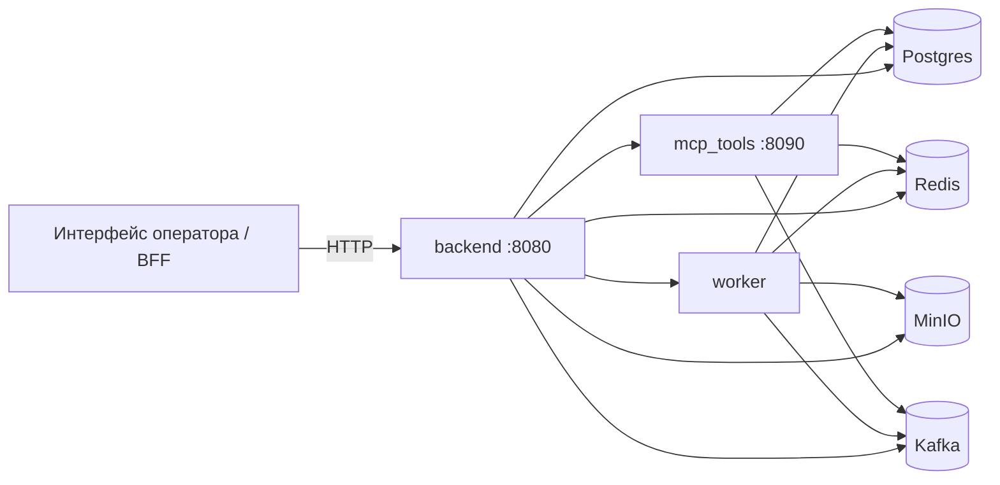
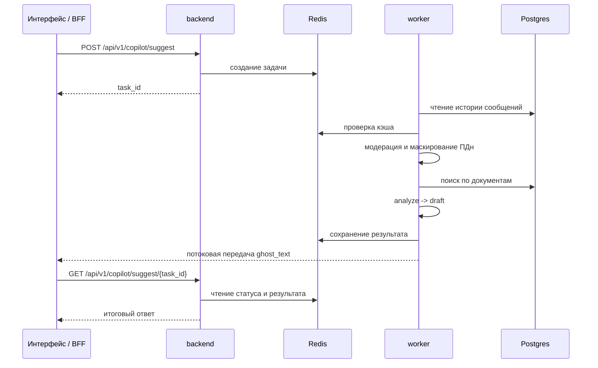
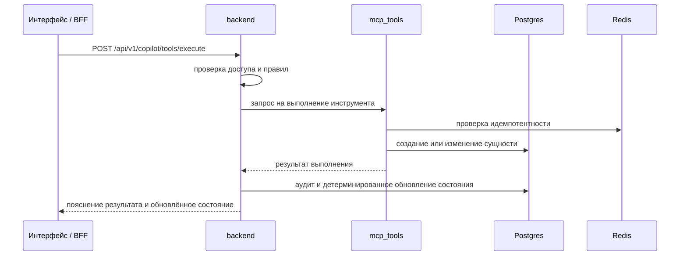

# LLM Copilot MVP

Серверная часть системы интеллектуальной поддержки оператора банка при обработке обращений по спорным операциям по банковским картам.

Проект предназначен для локального развёртывания, демонстрации и дальнейшего развития. Он реализует обработку диалогов, поиск по внутренним регламентам, формирование подсказок оператору, выполнение подтверждаемых действий через отдельный сервис инструментов и ведение расширенного журнала аудита.

## 1. Назначение проекта

Система предназначена для поддержки оператора в сценариях, где требуется:

- собирать обязательные уточнения по обращению клиента;
- различать типы карточных сценариев;
- соблюдать ограничения по защите персональных данных и противодействию социальной инженерии;
- не сообщать клиенту о действиях, которые фактически ещё не выполнены;
- сохранять связность между диалогом, кейсом, выполнением инструментов и журналом аудита.

Проект является серверным контуром операторского решения и может использоваться как основа для интеграции с BFF-слоем или пользовательским интерфейсом оператора.

## 2. Основные возможности

На текущем этапе реализованы:

- ведение диалогов по `conversation_id`;
- хранение сообщений и состояния диалога;
- асинхронное формирование подсказок оператору;
- получение текущего состояния copilot по разговору;
- поиск по внутренним регламентам и скриптам с возвратом источников;
- загрузка и индексация документов форматов `docx`, `pdf`, `txt`;
- начальная загрузка тестового корпуса документов для RAG;
- автоматическая переиндексация после загрузки документа;
- расширенные метаданные документов и фрагментов;
- единый модуль правил для этапов обработки, плана и доступности инструментов;
- выполнение инструментов через отдельный сервис `mcp_tools`;
- создание и сопровождение кейсов;
- потоковая передача `ghost_text` через SSE;
- механизм lease / heartbeat / reclaim для фоновых задач worker;
- маскирование персональных данных до передачи контекста в модель;
- безопасный режим при рискованных входных данных;
- подписанные внутренние служебные заголовки для межсервисного взаимодействия и операторских запросов;
- расширенный журнал аудита с `trace_id`, `prompt_hash`, `policy_version`, `state_before`, `state_after`, снимком поиска и информацией о кэше;
- воспроизведение и экспорт цепочки событий по `trace_id`;
- проверки `health` и `readiness`;
- идемпотентность вызовов инструментов с защитой от повторного использования одного `idempotency_key` для разных параметров.

## 3. Архитектура решения

Проект состоит из нескольких сервисов с общей контрактной и инфраструктурной базой:

- `backend` — внешний HTTP API, оркестрация, управление состоянием, доступом и аудитом;
- `worker` — асинхронный конвейер обработки подсказок;
- `mcp_tools` — сервис выполнения инструментов;
- `postgres` — основное хранилище данных, кейсов, документов и аудита;
- `redis` — кэш, состояние фоновых задач и служебные данные потоковой передачи;
- `minio` — объектное хранилище документов;
- `kafka` — шина событий.

### Ключевой принцип

Языковая модель не изменяет фактическое состояние системы напрямую.

Модель может предлагать текст, карточки, шаги и пояснения, но изменение состояния происходит только после получения фактического результата выполнения инструмента.

## 4. Схема взаимодействия сервисов

### 4.1 Общая схема



### 4.2 Формирование подсказки



### 4.3 Выполнение инструментов



## 5. Структура репозитория

```text
.
├── apps/
│   ├── backend/
│   ├── worker/
│   └── mcp_tools/
├── libs/
│   └── common/
├── packages/
│   └── contracts/
├── migrations/
├── docs/
│   └── rag_corpus/
├── tests/
├── docker-compose.yml
├── requirements.txt
├── Makefile
├── alembic.ini
└── .env.example
```

Назначение основных директорий:

- `apps/` — исполняемые сервисы;
- `libs/common/` — общий код и вспомогательные модули;
- `packages/contracts/` — контракты данных на базе Pydantic;
- `migrations/` — миграции схемы базы данных;
- `docs/rag_corpus/` — начальный корпус документов для RAG;
- `tests/` — набор автоматических тестов.

## 6. Технологический стек

- Python 3.11+
- FastAPI
- SQLAlchemy 2 + asyncpg
- PostgreSQL + pgvector
- Redis
- MinIO
- Kafka
- Alembic
- Pydantic v2
- Docker / Docker Compose

Для языковой модели и эмбеддингов поддерживаются несколько режимов:

- `stub` — для локальной разработки и демонстрации;
- `openai_compat` — для совместимого внешнего провайдера;
- внешний HTTP-адаптер — при необходимости.

## 7. Быстрый запуск

### 7.1 Требования

Необходимы:

- Docker и Docker Compose;
- свободные порты:
  - `8080`
  - `8090`
  - `5432`
  - `6379`
  - `9000`
  - `9001`
  - `19092`
- локальный файл `.env`.

### 7.2 Запуск

Linux/macOS:

```bash
cp .env.example .env
docker compose up -d --build
```

Windows CMD:

```cmd
copy .env.example .env
docker compose up -d --build
```

Сервис `migrate` выполняет `alembic upgrade head` до запуска `backend`, `worker` и `mcp_tools`.

### 7.3 Проверка состояния

```bash
curl http://localhost:8080/health
curl http://localhost:8080/readiness
curl http://localhost:8090/health
curl http://localhost:8090/readiness
docker compose ps
```

Пример ответа:

```json
{"ok":true,"service":"backend"}
```

Проверка `readiness` подтверждает не только запуск процесса, но и доступность его зависимостей.

## 8. Основные параметры конфигурации

В `.env` используются, в частности, следующие переменные:

- `APP_ENV`
- `DATABASE_URL`
- `REDIS_URL`
- `MINIO_ENDPOINT`
- `MINIO_ACCESS_KEY`
- `MINIO_SECRET_KEY`
- `MINIO_BUCKET`
- `MINIO_SECURE`
- `KAFKA_BOOTSTRAP`
- `KAFKA_ENABLED`
- `MCP_TOOLS_URL`
- `LLM_PROVIDER`
- `LLM_BASE_URL`
- `LLM_ANALYZE_MODEL`
- `LLM_DRAFT_MODEL`
- `LLM_EXPLAIN_MODEL`
- `LLM_GHOST_MODEL`
- `LLM_TEMPERATURE`
- `LLM_MAX_TOKENS`
- `LLM_API_KEY`
- `EMBED_PROVIDER`
- `EMBED_BASE_URL`
- `EMBED_MODEL`
- `RAG_SEED_DIR`

### Параметры внутренней аутентификации

- `INTERNAL_AUTH_TOKEN`
- `INTERNAL_AUTH_SIGNING_KEY`
- `INTERNAL_AUTH_TTL_SEC`
- `INTERNAL_AUTH_AUDIENCE`
- `INTERNAL_AUTH_ALLOWED_ISSUERS`
- `INTERNAL_AUTH_CLOCK_SKEW_SEC`
- `INTERNAL_AUTH_REQUIRE_REQUEST_ID`
- `INTERNAL_AUTH_ALLOW_LEGACY_TOKEN`
- `INTERNAL_AUTH_REQUIRE_SIGNED_FOR_SERVICE`
- `INTERNAL_AUTH_REQUIRE_SIGNED_FOR_OPERATOR`
- `INTERNAL_AUTH_REQUIRE_SIGNED_FOR_ALL`

## 9. Данные и тома Docker

В `docker-compose.yml` используются именованные тома:

- `postgres_data`
- `redis_data`
- `minio_data`
- `kafka_data`

Следствия:

- `docker compose down` удаляет контейнеры, но сохраняет данные;
- `docker compose down -v` удаляет контейнеры и тома, то есть полностью очищает локальное состояние.

После `docker compose down -v` документы и индекс RAG требуется загрузить заново.

## 10. Безопасность и модель доверия

### Подписанные внутренние заголовки

Во внутреннем контуре и для операторских запросов используются:

- `X-Internal-Claims`
- `X-Internal-Signature`
- `X-Request-Id`

Подписанные заголовки позволяют:

- ограничивать срок действия запроса;
- привязывать запрос к `request_id`;
- отделять доверенный внутренний трафик от недоверенного клиента;
- принудительно проверять контекст субъекта.

### Устаревший режим

Заголовки вида:

- `X-Internal-Auth`
- `X-Actor-Role`
- `X-Actor-Id`

поддерживаются только если это явно разрешено конфигурацией. При включённом требовании подписанных запросов для оператора обращения без `X-Internal-Claims` и `X-Internal-Signature` отклоняются.

### Защитные механизмы

Реализованы:

- маскирование персональных данных до передачи в модель;
- отдельная модерация входа, найденных фрагментов и ответа модели;
- безопасный режим при рискованных данных;
- запрет обхода правил выполнения инструментов;
- расширенный журнал событий безопасности.

## 11. Документы и поиск по знаниям

В репозитории присутствует начальный корпус документов в `docs/rag_corpus/`.

Основные группы документов:

- спорные операции и подозрительные списания;
- блокировка карты, утрата и кража;
- информационная безопасность и противодействие социальной инженерии;
- статусы кейса и эскалация;
- скрипты оператора;
- резервные сценарии действий.

### Возможности поиска

Реализованы:

- расширенные метаданные фрагментов:
  - `doc_code`
  - `version_label`
  - `effective_date`
  - `source_type`
  - `source_priority`
  - `section_path`
  - `chunk_type`
  - `risk_tags`
  - `is_mandatory_step`
- планировщик поисковых запросов;
- гибридный поиск;
- дополнительное ранжирование;
- учёт версии документа;
- автоматическая индексация после загрузки.

## 12. Проверенные сценарии локального запуска

Ниже приведены сценарии, которые были проверены на локальном Docker-контуре.

### 12.1 Загрузка начального корпуса документов

```bash
PYTHONPATH=packages/contracts/src:. python - <<'PY'
import uuid
import httpx
from libs.common.internal_auth import build_internal_headers

BASE = 'http://localhost:8080'
headers = build_internal_headers(
    actor_role='operator',
    actor_id='op-local',
    request_id=str(uuid.uuid4()),
    issuer='backend',
)

with httpx.Client(timeout=60.0) as c:
    r = c.post(f'{BASE}/api/v1/docs/bootstrap-seed', headers=headers)
    print(r.status_code)
    print(r.text)
PY
```

### 12.2 Получение списка документов

```bash
PYTHONPATH=packages/contracts/src:. python - <<'PY'
import uuid
import httpx
from libs.common.internal_auth import build_internal_headers

BASE = 'http://localhost:8080'
headers = build_internal_headers(
    actor_role='operator',
    actor_id='op-local',
    request_id=str(uuid.uuid4()),
    issuer='backend',
)

with httpx.Client(timeout=60.0) as c:
    r = c.get(f'{BASE}/api/v1/docs', headers=headers)
    print(r.status_code)
    print(r.text)
PY
```

### 12.3 Проверка поиска по знаниям

```bash
PYTHONPATH=packages/contracts/src:. python - <<'PY'
import uuid
import httpx
from libs.common.internal_auth import build_internal_headers

BASE = 'http://localhost:8080'
headers = build_internal_headers(
    actor_role='operator',
    actor_id='op-local',
    request_id=str(uuid.uuid4()),
    issuer='backend',
)

payload = {
    'query': 'клиент сообщил код из SMS и просит заблокировать карту',
    'top_k': 5,
}

with httpx.Client(timeout=60.0) as c:
    r = c.post(
        f'{BASE}/api/v1/rag/search',
        headers={**headers, 'Content-Type': 'application/json'},
        json=payload,
    )
    print(r.status_code)
    print(r.text)
PY
```

### 12.4 Создание разговора и формирование подсказки

```bash
PYTHONPATH=packages/contracts/src:. python - <<'PY'
import uuid
import httpx
from libs.common.internal_auth import build_internal_headers

BASE = 'http://localhost:8080'

def h(role='operator', actor_id='op-local', issuer='backend'):
    return build_internal_headers(
        actor_role=role,
        actor_id=actor_id,
        request_id=str(uuid.uuid4()),
        issuer=issuer,
    )

with httpx.Client(timeout=60.0) as c:
    conv_id = c.post(f'{BASE}/api/v1/chat/conversations', headers=h()).json()['conversation_id']

    c.post(
        f'{BASE}/api/v1/chat/conversations/{conv_id}/messages',
        headers=h(),
        json={'content': 'Клиент сообщает о подозрительной операции на 1290 RUB. Карта у него на руках.'},
    ).raise_for_status()

    r = c.post(
        f'{BASE}/api/v1/copilot/suggest',
        headers=h(),
        json={'conversation_id': conv_id, 'max_messages': 20},
    )
    print(r.status_code)
    print(r.text)
PY
```

### 12.5 Потоковая передача подсказки

```bash
PYTHONPATH=packages/contracts/src:. python - <<'PY'
import uuid
import httpx
from libs.common.internal_auth import build_internal_headers

BASE = 'http://localhost:8080'

def h(role='operator', actor_id='op-local', issuer='backend'):
    return build_internal_headers(
        actor_role=role,
        actor_id=actor_id,
        request_id=str(uuid.uuid4()),
        issuer=issuer,
    )

with httpx.Client(timeout=90.0) as c:
    conv_id = c.post(f'{BASE}/api/v1/chat/conversations', headers=h()).json()['conversation_id']
    c.post(
        f'{BASE}/api/v1/chat/conversations/{conv_id}/messages',
        headers=h(),
        json={'content': 'Я не совершал эту операцию, карта у меня'},
    ).raise_for_status()

    task_id = c.post(
        f'{BASE}/api/v1/copilot/suggest',
        headers=h(),
        json={'conversation_id': conv_id, 'max_messages': 20},
    ).json()['task_id']

    with c.stream(
        'GET',
        f'{BASE}/api/v1/copilot/suggest/{task_id}/stream',
        headers=h(),
        timeout=120.0,
    ) as r:
        r.raise_for_status()
        for line in r.iter_lines():
            if line:
                print(line)
PY
```

### 12.6 Поток событий диалога по SSE

```text
GET /api/v1/chat/stream?conversation_id=<CONVERSATION_ID>
```

### 12.7 Поток событий диалога по WebSocket

```text
ws://localhost:8080/api/v1/chat/ws?conversation_id=<CONVERSATION_ID>
```

### 12.8 Выполнение инструмента через backend

```text
POST /api/v1/copilot/tools/execute
```

### 12.9 Проверка идемпотентности сервиса `mcp_tools`

```bash
PYTHONPATH=packages/contracts/src:. python - <<'PY'
import uuid
import httpx
from libs.common.internal_auth import build_internal_headers

BASE = 'http://localhost:8090'

def h(role='operator', actor_id='op-local', issuer='backend'):
    return build_internal_headers(
        actor_role=role,
        actor_id=actor_id,
        request_id=str(uuid.uuid4()),
        issuer=issuer,
    )

payload1 = {
    'tool': 'block_card',
    'params': {'conversation_id': 'conv-runtime-1', 'reason': 'fraud'},
    'idempotency_key': 'idem-runtime-1',
    'actor_role': 'operator',
    'actor_id': 'op-local',
    'trace_id': 'trace-runtime-1',
}

payload2 = {
    'tool': 'block_card',
    'params': {'conversation_id': 'conv-runtime-1', 'reason': 'lost_card'},
    'idempotency_key': 'idem-runtime-1',
    'actor_role': 'operator',
    'actor_id': 'op-local',
    'trace_id': 'trace-runtime-2',
}

with httpx.Client(timeout=30.0) as c:
    r1 = c.post(f'{BASE}/api/v1/tools/execute', headers=h(), json=payload1)
    print('first:', r1.status_code, r1.text)

    r2 = c.post(f'{BASE}/api/v1/tools/execute', headers=h(), json=payload2)
    print('second:', r2.status_code, r2.text)
PY
```

## 13. Основные интерфейсы API

### Диалоги
- `POST /api/v1/chat/conversations`
- `GET /api/v1/chat/conversations/{conversation_id}/messages`
- `POST /api/v1/chat/conversations/{conversation_id}/messages`
- `GET /api/v1/chat/stream`
- `GET /api/v1/chat/ws`

### Copilot
- `POST /api/v1/copilot/suggest`
- `GET /api/v1/copilot/suggest/{task_id}`
- `GET /api/v1/copilot/suggest/{task_id}/stream`
- `POST /api/v1/copilot/suggest/{task_id}/cancel`
- `GET /api/v1/copilot/state?conversation_id=...`
- `POST /api/v1/copilot/tools/execute`
- `POST /api/v1/copilot/profile/confirm`

### Кейсы
- `GET /api/v1/cases`
- `GET /api/v1/cases/{case_id}`
- `PATCH /api/v1/cases/{case_id}`
- `GET /api/v1/cases/{case_id}/timeline`

### Документы и поиск
- `POST /api/v1/docs/upload`
- `POST /api/v1/docs/bootstrap-seed`
- `POST /api/v1/docs/reindex`
- `GET /api/v1/docs`
- `GET /api/v1/docs/{doc_id}`
- `GET /api/v1/docs/{doc_id}/chunks`
- `POST /api/v1/rag/search`

### Аудит и отладка
- `GET /api/v1/audit`
- `GET /api/v1/audit/trace/{trace_id}`
- `GET /api/v1/audit/trace/{trace_id}/replay`
- `GET /api/v1/audit/trace/{trace_id}/export`

## 14. Рекомендации по отображению на клиенте

### Левая колонка
- список разговоров;
- лента сообщений;
- поле ввода оператора.

### Центральная колонка
- `ghost_text`;
- `quick_cards`;
- `form_cards`;
- ручная правка сообщения перед отправкой.

### Правая колонка
Рекомендуется отображать из `sidebar`:

- `phase`
- `intent`
- `plan.steps`
- `sources`
- `tools`
- `risk_checklist`
- `danger_flags`
- `operator_notes`

Доступность действий должна определяться сервером, а не пользовательским интерфейсом.

## 15. Контроль состояния и отладка

### Проверки доступности
- `GET /health`
- `GET /readiness`

`readiness` проверяет зависимости:

- для `backend`:
  - Postgres
  - Redis
  - MinIO
  - Kafka
- для `mcp_tools`:
  - Redis
  - Kafka

### Воспроизведение и экспорт

Поддерживаются:

- просмотр полной цепочки событий по `trace_id`;
- просмотр `state_before` и `state_after`;
- просмотр снимка поиска;
- просмотр информации о кэше;
- экспорт полной цепочки событий.

### Отладка RAG

Поддерживаются:

- просмотр списка документов;
- переиндексация выбранного документа;
- просмотр фрагментов документа.

## 16. Команды разработки

```bash
make up
make down
make reset
make logs
make ps
make migrate
make rebuild
make test
make lint
```

### Локальный запуск тестов без Docker

Linux/macOS:

```bash
python -m venv .venv
source .venv/bin/activate
pip install -r requirements.txt
PYTHONPATH=packages/contracts/src:. python -m pytest -q
```

Windows CMD:

```cmd
python -m venv .venv
.venv\Scripts\activate
pip install -r requirements.txt
set PYTHONPATH=packages/contracts/src;.
python -m pytest -q
```

### Быстрая проверка синтаксиса

```bash
python -m compileall apps libs packages/contracts/src tests
```

## 17. Текущее состояние проекта

На текущий момент в локальном Docker-контуре подтверждены:

- успешный запуск полного стека после `docker compose down -v`;
- повторная загрузка начального корпуса документов;
- корректная работа поиска по регламентам;
- корректная потоковая передача подсказки оператора;
- корректная работа `chat` по SSE и WebSocket;
- принудительное применение подписанных операторских заголовков;
- корректная идемпотентность вызовов `mcp_tools` на уровне HTTP и автоматических тестов;
- успешное прохождение полного набора автоматических тестов.

## 18. Дальнейшее развитие

Уже реализованы:

- расширенные метаданные RAG;
- автоматическая индексация документов;
- единый модуль правил обработки;
- повышение устойчивости worker;
- подписанные внутренние заголовки;
- усиленное маскирование данных;
- расширенный журнал аудита;
- инструменты воспроизведения и экспорта;
- проверки `health` и `readiness`;
- строгая идемпотентность вызовов инструментов.

В дальнейшем планируется:

- оценка готовности кейса к выполнению действий;
- более содержательная модель `missing_fields`;
- итоговое досье по завершённым обращениям;
- расширение предметной модели;
- дальнейшее развитие аналитики и сценариев.

## 19. Итог

`LLM Copilot MVP` представляет собой рабочий серверный контур интеллектуальной поддержки оператора банка. Проект позволяет развернуть локальный стенд, подключить пользовательский интерфейс или BFF, выполнять сценарии через API, тестировать поиск по знаниям, выполнение инструментов и детерминированное управление состоянием, а также развивать решение без пересмотра его архитектурной основы.
