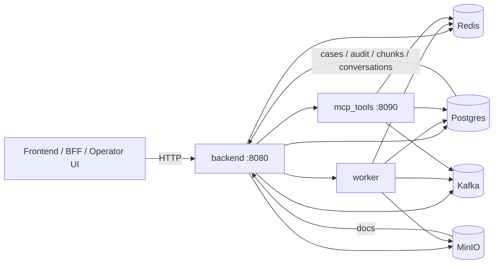
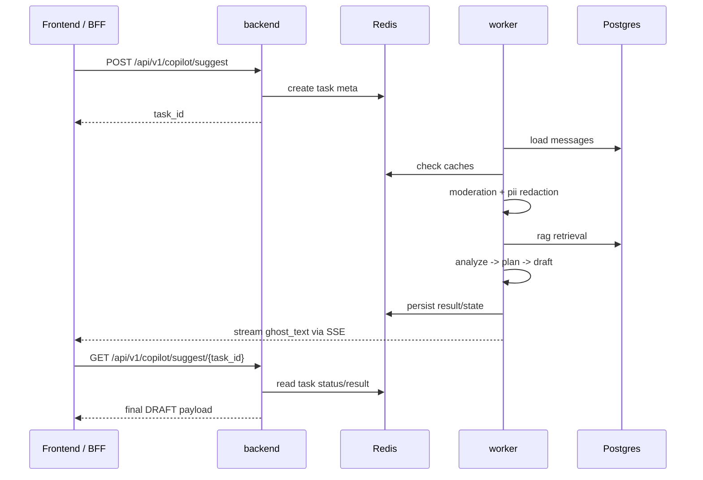
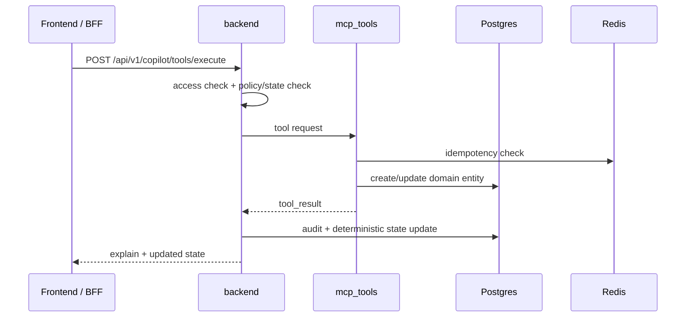

# LLM Copilot MVP

MVP-платформа операторского copilot-сценария для обработки карточных обращений: подозрительные списания, блокировка карты, создание обращения, retrieval по внутренним регламентам, audit trail и контролируемое выполнение действий через tools.

Проект представляет собой backend-контур для операторского copilot-а, который помогает оператору действовать в соответствии с регламентом, используя RAG, tool-driven flow, аудит и детерминированное управление состоянием.

---

## 1. Назначение проекта

`LLM Copilot MVP` предназначен для поддержки операторов карточной линии в сценариях, где требуется:

- собирать обязательные уточнения по обращению;
- различать типы карточных сценариев;
- соблюдать ограничения по защите персональных данных и противодействию социальной инженерии;
- не сообщать клиенту о действиях, которые фактически еще не были выполнены;
- сохранять связность между диалогом, кейсом, tool execution и audit trail.

Система реализует контролируемый pipeline, который:

- хранит разговоры и сообщения;
- формирует suggestion для оператора;
- поднимает релевантные источники из RAG;
- показывает доступные действия по текущему состоянию сценария;
- выполняет инструменты через отдельный сервис;
- сохраняет аудит и объектное состояние.

Проект является **MVP/dev-стендом**, предназначенным для разработки, демонстрации и дальнейшего развития. Он не позиционируется как готовая production-система банка.

---

## 2. Основные возможности

На текущем этапе проект поддерживает:

- ведение диалогов по `conversation_id`;
- создание task-based copilot suggestions;
- хранение и выдачу `copilot state` по разговору;
- запуск инструментов через отдельный `mcp_tools` сервис;
- создание кейсов и ведение `audit trail`;
- индексацию документов в RAG и поиск по ним;
- ingest документов в форматах `docx / pdf / txt`;
- автоматическую индексацию документов после upload;
- различение источников типов `policy / security / script / procedure`;
- использование enriched metadata в retrieval;
- ограничение доступа на уровне `conversation`, `case`, `task`;
- включение `safe mode` для рискованных входов;
- единый state engine для `plan / phase / tool gating`;
- lease/heartbeat/reclaim для worker-задач;
- streaming `ghost_text` через SSE;
- расширенный audit с `trace_id`, `prompt_hash`, `policy_version`, `state_before/state_after`, retrieval snapshot и cache info;
- readiness checks и debug endpoints.

---

## 3. Архитектурная концепция

Проект состоит из нескольких сервисов с общей инфраструктурной и контрактной базой:

- `backend` — внешний HTTP API, оркестрация и управление state;
- `worker` — асинхронный pipeline suggest/analyze/draft;
- `mcp_tools` — сервис выполнения инструментов;
- `postgres` — основное состояние и аудит;
- `redis` — task state, кэш, streaming/meta state;
- `minio` — хранение документов;
- `kafka` — event bus.

### Ключевой принцип

LLM не изменяет фактическое состояние системы напрямую.

Модель может предлагать шаги, текст, карточки и объяснения, однако реальное состояние изменяется только после получения фактического `tool_result`.

---

## 4. Схема сервисов

### 4.1 Общая топология



### 4.2 Pipeline `suggest`



### 4.3 Pipeline `tool execution`



---

## 5. Структура репозитория

```text
.
├── apps/
│   ├── backend/
│   │   └── app/
│   │       ├── api/v1/routes/
│   │       └── core/
│   ├── worker/
│   └── mcp_tools/
├── libs/
│   └── common/
├── packages/
│   └── contracts/
├── migrations/
│   ├── env.py
│   └── versions/
├── docs/
│   └── rag_corpus/
├── tests/
├── docker-compose.yml
├── requirements.txt
├── Makefile
├── alembic.ini
└── .env.example
```

Назначение директорий:

- `apps/` — исполняемые сервисы;
- `libs/common/` — общий код;
- `packages/contracts/` — pydantic-контракты;
- `migrations/` — управляемая эволюция схемы базы данных;
- `docs/rag_corpus/` — seed corpus для RAG.

---

## 6. Технологический стек

- Python 3.11+
- FastAPI
- SQLAlchemy 2 + asyncpg
- PostgreSQL + pgvector
- Redis
- MinIO
- Kafka
- Alembic
- Pydantic v2
- Docker / Docker Compose

LLM и embeddings поддерживают следующие режимы подключения:

- `stub` — для локальной разработки;
- `openai_compat` — для реального провайдера;
- внешний HTTP-адаптер — при необходимости.

---

## 7. Быстрый старт

### 7.1 Требования

Для запуска необходимы:

- Docker + Docker Compose;
- свободные порты:
  - `8080`
  - `8090`
  - `5432`
  - `6379`
  - `9000`
  - `9001`
  - `9092`
- локальный `.env`.

### 7.2 Запуск стека

Linux/macOS:

```bash
cp .env.example .env
docker compose up -d --build
```

Windows CMD:

```cmd
copy .env.example .env
docker compose up -d --build
```

`docker-compose.yml` содержит отдельный сервис `migrate`, который выполняет `alembic upgrade head` до запуска `backend`, `worker` и `mcp_tools`.

### 7.3 Проверка состояния сервисов

```bash
curl http://localhost:8080/health
curl http://localhost:8080/readiness
curl http://localhost:8090/health
curl http://localhost:8090/readiness
docker compose ps
```

Пример ответа `health`:

```json
{"ok":true,"service":"backend"}
```

Endpoint `readiness` проверяет не только факт запуска процесса, но и доступность его зависимостей.

---

## 8. Конфигурация

Основные переменные окружения в `.env`:

- `APP_ENV`
- `INTERNAL_AUTH_TOKEN`
- `INTERNAL_AUTH_SIGNING_KEY`
- `DATABASE_URL`
- `REDIS_URL`
- `MINIO_ENDPOINT`
- `MINIO_ACCESS_KEY`
- `MINIO_SECRET_KEY`
- `MINIO_BUCKET`
- `MINIO_SECURE`
- `KAFKA_BOOTSTRAP`
- `KAFKA_ENABLED`
- `MCP_TOOLS_URL`
- `LLM_PROVIDER`
- `LLM_BASE_URL`
- `LLM_ANALYZE_MODEL`
- `LLM_DRAFT_MODEL`
- `LLM_EXPLAIN_MODEL`
- `LLM_GHOST_MODEL`
- `LLM_TEMPERATURE`
- `LLM_MAX_TOKENS`
- `LLM_API_KEY`
- `EMBED_PROVIDER`
- `EMBED_BASE_URL`
- `EMBED_MODEL`
- `RAG_SEED_DIR`

Для локальной разработки можно использовать `LLM_PROVIDER=stub`.  
Для подключения реального провайдера применяется режим `openai_compat`.

---

## 9. Данные и volumes

В `docker-compose.yml` используются следующие named volumes:

- `postgres_data`
- `redis_data`
- `minio_data`

Следствия:

- `docker compose down` удаляет контейнеры, но сохраняет данные;
- `docker compose down -v` удаляет контейнеры и volumes, то есть полностью очищает локальное состояние.

---

## 10. Безопасность и модель доверия

### Локальная разработка

Для operator-запросов в локальном dev-режиме можно использовать legacy-заголовки:

- `X-Internal-Auth`
- `X-Actor-Role`
- `X-Actor-Id`

### Service-to-service взаимодействие

Внутренние сервисы используют подписанные claims:

- `X-Internal-Claims`
- `X-Internal-Signature`
- `X-Request-Id`

Это требуется для:

- ограничения TTL запросов;
- привязки к `request_id`;
- усиления внутренней доверенной границы.

### Guardrails

Проект дополнительно:

- маскирует PII до передачи в LLM;
- различает moderation для input / retrieved chunks / output;
- блокирует опасные подсказки;
- не позволяет обойти policy/state engine при выполнении tools;
- ведет расширенный security-oriented audit.

---

## 11. Seed-корпус RAG

В проекте присутствует стартовый корпус документов в `docs/rag_corpus/`.

Основные типы документов:

- dispute / suspicious transaction;
- block / lost / stolen;
- security / anti-social-engineering;
- status / escalation;
- operator scripts.

### Возможности retrieval

- enriched metadata:
  - `doc_code`
  - `version_label`
  - `effective_date`
  - `source_type`
  - `source_priority`
  - `section_path`
  - `chunk_type`
  - `risk_tags`
  - `is_mandatory_step`
- query planner;
- hybrid retrieval;
- internal rerank;
- version-aware scoring;
- auto-index после upload.

---

## 12. Smoke test

Ниже приведены примеры для локального dev через legacy operator headers.

### 12.1 Загрузка seed corpus

```bash
curl -s -X POST "http://localhost:8080/api/v1/docs/bootstrap-seed" \
  -H "X-Internal-Auth: dev-internal-token" \
  -H "X-Actor-Role: operator" \
  -H "X-Actor-Id: op-1"
```

### 12.2 Просмотр списка документов

```bash
curl -s "http://localhost:8080/api/v1/docs" \
  -H "X-Internal-Auth: dev-internal-token" \
  -H "X-Actor-Role: operator" \
  -H "X-Actor-Id: op-1"
```

### 12.3 Просмотр чанков документа

```bash
curl -s "http://localhost:8080/api/v1/docs/<DOC_ID>/chunks?limit=20" \
  -H "X-Internal-Auth: dev-internal-token" \
  -H "X-Actor-Role: operator" \
  -H "X-Actor-Id: op-1"
```

### 12.4 Selective reindex

```bash
curl -s -X POST "http://localhost:8080/api/v1/docs/reindex?doc_id=<DOC_ID>" \
  -H "X-Internal-Auth: dev-internal-token" \
  -H "X-Actor-Role: operator" \
  -H "X-Actor-Id: op-1"
```

### 12.5 Проверка RAG

```bash
curl -s -X POST "http://localhost:8080/api/v1/rag/search" \
  -H "X-Internal-Auth: dev-internal-token" \
  -H "X-Actor-Role: operator" \
  -H "X-Actor-Id: op-1" \
  -H "Content-Type: application/json" \
  --data '{"query":"клиент сообщил код из SMS и просит заблокировать карту","top_k":5}'
```

### 12.6 Создание разговора

```bash
curl -s -X POST "http://localhost:8080/api/v1/chat/conversations" \
  -H "X-Internal-Auth: dev-internal-token" \
  -H "X-Actor-Role: operator" \
  -H "X-Actor-Id: op-1"
```

### 12.7 Отправка сообщения

```bash
curl -s -X POST "http://localhost:8080/api/v1/chat/conversations/<CONVERSATION_ID>/messages" \
  -H "X-Internal-Auth: dev-internal-token" \
  -H "X-Actor-Role: operator" \
  -H "X-Actor-Id: op-1" \
  -H "Content-Type: application/json" \
  --data '{"actor_role":"client","actor_id":"client-1","content":"Я не совершал эту операцию, карта у меня"}'
```

### 12.8 Запуск suggest

```bash
curl -s -X POST "http://localhost:8080/api/v1/copilot/suggest" \
  -H "X-Internal-Auth: dev-internal-token" \
  -H "X-Actor-Role: operator" \
  -H "X-Actor-Id: op-1" \
  -H "Content-Type: application/json" \
  --data '{"conversation_id":"<CONVERSATION_ID>","max_messages":20}'
```

Ответ возвращает `task_id`.

### 12.9 Чтение status/result

```bash
curl -s "http://localhost:8080/api/v1/copilot/suggest/<TASK_ID>" \
  -H "X-Internal-Auth: dev-internal-token" \
  -H "X-Actor-Role: operator" \
  -H "X-Actor-Id: op-1"
```

### 12.10 Streaming прогресса

```bash
curl -N "http://localhost:8080/api/v1/copilot/suggest/<TASK_ID>/stream" \
  -H "X-Internal-Auth: dev-internal-token" \
  -H "X-Actor-Role: operator" \
  -H "X-Actor-Id: op-1"
```

### 12.11 Выполнение tool

```bash
curl -s -X POST "http://localhost:8080/api/v1/copilot/tools/execute" \
  -H "X-Internal-Auth: dev-internal-token" \
  -H "X-Actor-Role: operator" \
  -H "X-Actor-Id: op-1" \
  -H "Content-Type: application/json" \
  --data '{
    "conversation_id":"<CONVERSATION_ID>",
    "tool":"create_case",
    "params":{"intent":"SuspiciousTransaction"},
    "idempotency_key":"tool-001"
  }'
```

---

## 13. API для интеграции с frontend

### Диалоги
- `POST /api/v1/chat/conversations`
- `GET /api/v1/chat/conversations/{conversation_id}/messages`
- `POST /api/v1/chat/conversations/{conversation_id}/messages`
- `GET /api/v1/chat/stream`
- `GET /api/v1/chat/ws`

### Copilot
- `POST /api/v1/copilot/suggest`
- `GET /api/v1/copilot/suggest/{task_id}`
- `GET /api/v1/copilot/suggest/{task_id}/stream`
- `POST /api/v1/copilot/suggest/{task_id}/cancel`
- `GET /api/v1/copilot/state?conversation_id=...`
- `POST /api/v1/copilot/tools/execute`
- `POST /api/v1/copilot/profile/confirm`

### Cases
- `GET /api/v1/cases`
- `GET /api/v1/cases/{case_id}`
- `PATCH /api/v1/cases/{case_id}`
- `GET /api/v1/cases/{case_id}/timeline`

### Docs / RAG
- `POST /api/v1/docs/upload`
- `POST /api/v1/docs/bootstrap-seed`
- `POST /api/v1/docs/reindex`
- `GET /api/v1/docs`
- `GET /api/v1/docs/{doc_id}`
- `GET /api/v1/docs/{doc_id}/chunks`
- `POST /api/v1/rag/search`

### Audit / debug
- `GET /api/v1/audit`
- `GET /api/v1/audit/trace/{trace_id}`
- `GET /api/v1/audit/trace/{trace_id}/replay`
- `GET /api/v1/audit/trace/{trace_id}/export`

---

## 14. Рекомендации по frontend-рендерингу

### Левая колонка
- список разговоров;
- текущая лента сообщений;
- поле ввода оператора.

### Центральная колонка
- `ghost_text`;
- `quick_cards`;
- `form_cards`;
- ручная правка сообщения перед отправкой.

### Правая колонка
Рекомендуется рендерить из `sidebar`:

- `phase`
- `intent`
- `plan.steps`
- `sources`
- `tools`
- `risk_checklist`
- `danger_flags`
- `operator_notes`

### Action bar

Действия следует строить на основе `sidebar.tools`.

Frontend должен учитывать `enabled/reason`, а не определять доступность действий самостоятельно.

---

## 15. Debug и observability

### Health / readiness
- `GET /health`
- `GET /readiness`

`readiness` проверяет зависимости:

- backend:
  - Postgres
  - Redis
  - MinIO
  - Kafka
- mcp_tools:
  - Redis
  - Kafka

### Replay / export

Поддерживается:

- просмотр полной цепочки событий по `trace_id`;
- просмотр `state_before / state_after`;
- просмотр retrieval snapshot;
- просмотр cache info;
- экспорт trace целиком.

### RAG debug

Поддерживается:

- просмотр списка документов;
- reindex конкретного документа;
- просмотр чанков документа.

---

## 16. Команды разработки

```bash
make up
make down
make reset
make logs
make ps
make migrate
make rebuild
make test
make lint
```

### Локальный запуск тестов без Docker

Linux/macOS:

```bash
python -m venv .venv
source .venv/bin/activate
pip install -r requirements.txt
PYTHONPATH=packages/contracts/src:. pytest -q
```

Windows CMD:

```cmd
python -m venv .venv
.venv\Scripts\activate
pip install -r requirements.txt
set PYTHONPATH=packages/contracts/src;.
pytest -q
```

### Быстрая проверка синтаксиса

```bash
python -m compileall apps libs packages/contracts/src tests
```

---

## 17. Дальнейшее развитие

Реализовано:

- richer RAG metadata;
- auto-index;
- unified state engine;
- worker hardening;
- signed claims;
- redaction hardening;
- JSONB audit trail;
- replay/debug toolkit;
- health/readiness.

Планируется:

- readiness score по кейсу;
- более содержательный `missing_fields`;
- итоговое досье;
- расширение domain layer;
- дальнейшее развитие аналитики и сценариев.

---

## 18. Что не следует коммитить

Не следует включать в репозиторий и архивы:

- `.env`
- `.git`
- `__pycache__`
- `.pytest_cache`
- `.DS_Store`
- дампы
- временные build artifacts

---

## 19. Итог

`LLM Copilot MVP` представляет собой рабочий backend-контур операторского copilot-а, который позволяет:

- развернуть локальный dev-стенд;
- интегрировать frontend или BFF;
- выполнять сценарии через API;
- тестировать retrieval, tool-driven flow и state machine;
- отлаживать поведение через trace и audit;
- развивать продукт без полного пересмотра архитектурного фундамента.
