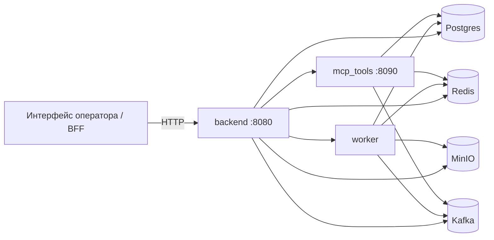
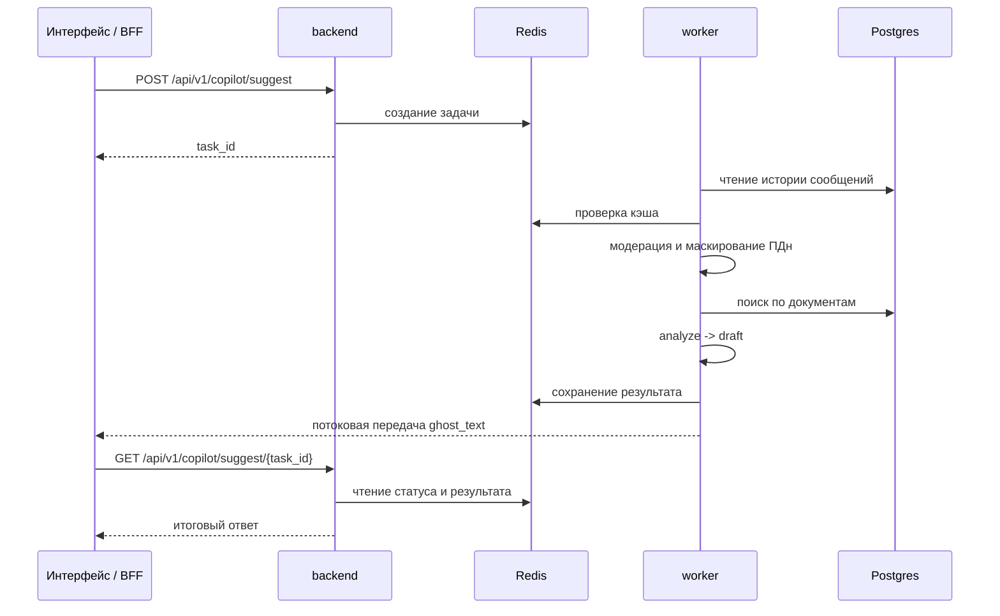
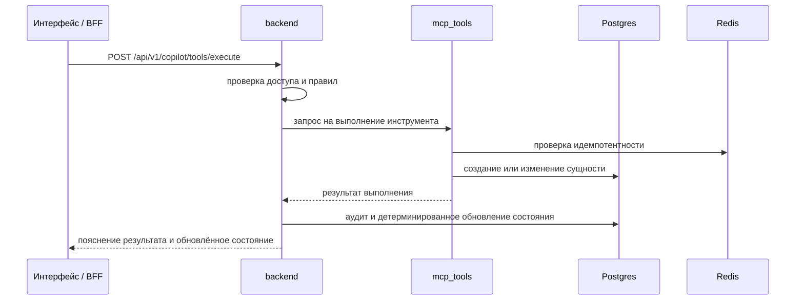

# LLM Copilot для операторской поддержки банка

Серверный контур системы интеллектуальной поддержки оператора при обработке обращений по банковским картам. Проект развёртывается локально, работает в Docker, поддерживает поиск по внутренним регламентам, формирует подсказки оператору, ведёт кейсы и аудит, а подтверждаемые действия выполняет через отдельный сервис инструментов.

## Назначение

Система нужна для сценариев, где оператор должен:

- принять сообщение клиента и сохранить историю диалога;
- понять тип карточного сценария;
- собрать недостающие подтверждения без лишних вопросов;
- опираться на внутренние регламенты и операторские скрипты;
- не запрашивать секреты и не обещать результат, которого ещё нет;
- выполнять действия только после подтверждения и через отдельный инструментальный контур;
- сохранять связность между диалогом, состоянием copilot, кейсом и журналом аудита.

Проект можно использовать как серверную основу для BFF или интерфейса оператора.

## Что реализовано

В текущем состоянии проект поддерживает:

- хранение разговоров и сообщений по `conversation_id`;
- поток событий чата через SSE и WebSocket;
- асинхронное формирование подсказки оператору через `backend + worker`;
- поиск по регламентам и скриптам с возвратом источников;
- загрузку, переиндексацию и начальную загрузку корпуса документов для RAG;
- формирование `ghost_text`, `quick_cards`, `sidebar`, плана шагов и списка допустимых действий;
- детерминированное управление состоянием после выполнения инструмента;
- ведение карточных кейсов, readiness, timeline и dossier;
- отдельный сервис `mcp_tools` с идемпотентностью и строгой валидацией;
- маскирование ПДн, модерацию входа, найденных фрагментов и ответа модели;
- signed service-to-service и signed operator-запросы во внутреннем контуре;
- расширенный аудит с `trace_id`, `state_before`, `state_after`, retrieval snapshot и информацией о кэше;
- воспроизведение и экспорт цепочки событий по `trace_id`.

## Поддерживаемые сценарии

На уровне доменной логики и runtime smoke подтверждены следующие ветки:

- `LostStolen`;
- `SuspiciousTransaction / suspicious`;
- `SuspiciousTransaction / recurring_subscription`;
- `SuspiciousTransaction / duplicate_charge`;
- `SuspiciousTransaction / reversal_pending`;
- `SuspiciousTransaction / merchant_dispute`;
- `CardNotWorking / online`;
- `StatusWhatNext`;
- `UnblockReissue`.

## Архитектура

Сервисы:

- `backend` — HTTP API, доступ, оркестрация, состояние, кейсы и аудит;
- `worker` — асинхронный конвейер `ANALYZE -> RAG -> DRAFT`;
- `mcp_tools` — выполнение подтверждаемых инструментов;
- `postgres` — разговоры, кейсы, аудит, документы, векторы;
- `redis` — очереди, кэш, статусы задач, потоковые события;
- `minio` — хранение документов;
- `kafka` — event bus.

Ключевой принцип: языковая модель не меняет состояние системы напрямую. Она формирует анализ, черновик и пояснения, а фактическое изменение состояния происходит только после результата инструмента.

## Схема взаимодействия сервисов

### Общая схема



### Формирование подсказки



### Выполнение инструментов



## Структура репозитория

```text
.
├── apps/
│   ├── backend/
│   ├── worker/
│   └── mcp_tools/
├── libs/
│   └── common/
├── packages/
│   └── contracts/
├── migrations/
├── docs/
│   ├── rag_corpus/
│   └── eval/
├── tests/
├── scripts/
├── docker-compose.yml
├── requirements.txt
├── Makefile
└── .env.example
```

## Быстрый запуск

```bash
cp .env.example .env
docker compose up -d --build
```

Базовая проверка:

```bash
curl http://localhost:8080/health
curl http://localhost:8080/readiness
curl http://localhost:8090/health
curl http://localhost:8090/readiness
docker compose ps
```

## Модель доступа и доверия

Браузер не считается доверенной стороной. Все реальные вызовы должны идти через серверный BFF. `backend` и `mcp_tools` ожидают signed internal headers с контекстом субъекта.

Используются заголовки:

- `X-Internal-Claims`
- `X-Internal-Signature`
- `X-Request-Id`
- `X-Actor-Role`
- `X-Actor-Id`
- при необходимости `X-Origin-Actor-Role` и `X-Origin-Actor-Id`

Роли:

- `operator` — пользовательский и операторский контур;
- `service` — межсервисный контур.

Что важно учитывать:

- защищённые backend-endpoint без signed headers возвращают `401`;
- direct-вызов `mcp_tools /api/v1/tools/execute` требует `actor_role=operator`, а вызов с `service`-заголовками возвращает `403`;
- `POST /api/v1/copilot/tools/execute` в backend требует уже построенный `copilot state` для `conversation_id`, иначе возвращает `409`;
- reuse одного `idempotency_key` в `mcp_tools` с другими `params` возвращает `409`.

## API: backend

### Публичные маршруты

#### Диалоги

- `POST /api/v1/chat/conversations`
- `GET /api/v1/chat/conversations/{conversation_id}/messages`
- `POST /api/v1/chat/conversations/{conversation_id}/messages`
- `GET /api/v1/chat/stream`
- `GET /api/v1/chat/ws`

#### Copilot

- `POST /api/v1/copilot/suggest`
- `GET /api/v1/copilot/suggest/{task_id}`
- `POST /api/v1/copilot/suggest/{task_id}/cancel`
- `GET /api/v1/copilot/suggest/{task_id}/stream`
- `GET /api/v1/copilot/state`
- `POST /api/v1/copilot/tools/execute`
- `POST /api/v1/copilot/profile/confirm`

#### Кейсы

- `GET /api/v1/cases`
- `GET /api/v1/cases/{case_id}`
- `GET /api/v1/cases/{case_id}/dossier`
- `PATCH /api/v1/cases/{case_id}`
- `GET /api/v1/cases/{case_id}/timeline`

#### Технические проверки

- `GET /health`
- `GET /readiness`

### Скрытые backend-endpoint

- `POST /api/v1/docs/upload`
- `POST /api/v1/docs/bootstrap-seed`
- `POST /api/v1/docs/reindex`
- `GET /api/v1/docs`
- `GET /api/v1/docs/{doc_id}`
- `GET /api/v1/docs/{doc_id}/chunks`
- `POST /api/v1/rag/search`
- `GET /api/v1/audit`
- `GET /api/v1/audit/trace/{trace_id}`
- `GET /api/v1/audit/trace/{trace_id}/replay`
- `GET /api/v1/audit/trace/{trace_id}/export`
- `POST /api/v1/_internal/cases/create`
- `GET /api/v1/_internal/cases/status`

## API: `mcp_tools`

- `POST /api/v1/tools/execute`
- `GET /health`
- `GET /readiness`

Поддерживаемые инструменты:

- `create_case`
- `get_case_status`
- `get_transactions`
- `block_card`
- `unblock_card`
- `reissue_card`
- `get_card_limits`
- `set_card_limits`
- `toggle_online_payments`

## Примеры запросов и ответов для frontend/BFF

Ниже именно интеграционные примеры. Они нужны не браузеру напрямую, а BFF, который уже добавляет signed internal headers.

### 1. Создание разговора

Запрос:

```http
POST /api/v1/chat/conversations
```

Ответ:

```json
{
  "conversation_id": "9384fe5f-67e5-4003-be84-33d2811d6ecb"
}
```

### 2. Отправка сообщения в разговор

Запрос:

```http
POST /api/v1/chat/conversations/{conversation_id}/messages
Content-Type: application/json

{
  "content": "Я не совершал эту операцию, карта у меня"
}
```

Минимальный практический пример `curl`:

```bash
curl -s -X POST "http://localhost:8080/api/v1/chat/conversations/<CONVERSATION_ID>/messages" \
  -H "Content-Type: application/json" \
  --data '{"content":"Я не совершал эту операцию, карта у меня"}'
```

Ответ:

```json
{
  "id": 14
}
```

### 3. Запуск `suggest`

Запрос:

```http
POST /api/v1/copilot/suggest
Content-Type: application/json

{
  "conversation_id": "9384fe5f-67e5-4003-be84-33d2811d6ecb",
  "max_messages": 20
}
```

Ответ:

```json
{
  "task_id": "28d5c0b4-f51f-4c29-94e9-c7e2ef2a090d"
}
```

### 4. Polling статуса задачи

Запрос:

```http
GET /api/v1/copilot/suggest/{task_id}
```

Промежуточный ответ:

```json
{
  "task_id": "28d5c0b4-f51f-4c29-94e9-c7e2ef2a090d",
  "status": "running",
  "error": null,
  "result": null
}
```

Финальный ответ:

```json
{
  "task_id": "28d5c0b4-f51f-4c29-94e9-c7e2ef2a090d",
  "status": "succeeded",
  "error": null,
  "result": {
    "schema_version": "1.0",
    "ghost_text": "Понимаю ваше беспокойство...",
    "quick_cards": [],
    "form_cards": [],
    "sidebar": {
      "phase": "Collect",
      "intent": "SuspiciousTransaction",
      "plan": {
        "current_step_id": "collect_core",
        "steps": []
      },
      "sources": [],
      "tools": [],
      "risk_checklist": [],
      "danger_flags": []
    }
  }
}
```

### 5. SSE-стрим прогресса `suggest`

Запрос:

```http
GET /api/v1/copilot/suggest/{task_id}/stream
```

Типовые события:

```text
event: status
data: {"task_id":"...","status":"running"}

event: progress
data: {"task_id":"...","progress":35}

event: ghost
data: {"task_id":"...","text":"Понимаю ваше беспокойство..."}

event: result
data: {"task_id":"...","result":{...DRAFT JSON...}}
```

Для frontend это удобно разделять на две зоны:
- polling или SSE для статуса задачи;
- отдельный рендер `ghost_text` по мере прихода кусочков.

### 6. Получение текущего `copilot state`

Запрос:

```http
GET /api/v1/copilot/state?conversation_id=9384fe5f-67e5-4003-be84-33d2811d6ecb
```

Ответ сокращённо:

```json
{
  "conversation_id": "9384fe5f-67e5-4003-be84-33d2811d6ecb",
  "intent": "SuspiciousTransaction",
  "phase": "Collect",
  "plan": {
    "current_step_id": "collect_core",
    "steps": [
      {"id":"collect_core","title":"Сбор обязательных данных","done":false}
    ]
  },
  "last_analyze": {
    "missing_fields": ["txn_amount_confirm","txn_datetime_confirm"],
    "next_questions": [
      "Подтвердите сумму спорной операции.",
      "Подтвердите примерные дату и время спорной операции."
    ]
  },
  "last_draft": {
    "ghost_text": "Понимаю ваше беспокойство...",
    "sidebar": {
      "tools": [
        {
          "tool": "create_case",
          "label": "Создать обращение",
          "enabled": true,
          "reason": "Можно зарегистрировать обращение с последующим уточнением."
        },
        {
          "tool": "get_transactions",
          "label": "Открыть операции (mock)",
          "enabled": false,
          "reason": "Нужно уточнить наличие карты, сумму и время операции."
        }
      ]
    }
  }
}
```

### 7. Как frontend должен рендерить `state` и `draft`

Практически полезно раскладывать ответ так:

- левая колонка: история сообщений;
- центральная колонка: `ghost_text`, `quick_cards`, `form_cards`;
- правая колонка: `sidebar.phase`, `sidebar.intent`, `sidebar.plan.steps`, `sidebar.sources`, `sidebar.tools`, `sidebar.risk_checklist`, `sidebar.danger_flags`;
- action bar: только `sidebar.tools`, учитывая `enabled/reason`.

Frontend не должен сам придумывать, какие кнопки активны. Источник истины — `sidebar.tools[].enabled`.

### 8. Выполнение инструмента через backend

Запрос:

```http
POST /api/v1/copilot/tools/execute
Content-Type: application/json

{
  "conversation_id": "4d462def-167f-4d3e-9fc0-f5452a769dd2",
  "tool": "create_case",
  "params": {
    "intent": "SuspiciousTransaction",
    "summary_public": "Endpoint smoke case"
  },
  "idempotency_key": "case-001"
}
```

Ответ сокращённо:

```json
{
  "tool": "create_case",
  "result": {
    "case_id": "e4fc936a-6fd5-4a07-bfce-4d6ef510ae80",
    "status": "open",
    "case_type": "SuspiciousTransaction",
    "priority": "high",
    "sla_deadline": "2026-04-26T09:01:22.506942+00:00",
    "created_at": "2026-04-23T09:01:22.507626+00:00"
  },
  "explain": {
    "schema_version": "1.0",
    "ghost_text": "Обращение зарегистрировано...",
    "updates": {
      "phase": "Act",
      "plan": {
        "current_step_id": "act_get_txn",
        "steps": []
      }
    },
    "quick_cards": [
      {
        "title": "Сообщить номер обращения",
        "insert_text": "Обращение зарегистрировано. Номер обращения: e4fc936a-6fd5-4a07-bfce-4d6ef510ae80.",
        "kind": "status"
      }
    ]
  }
}
```

Важно:
- сначала для `conversation_id` должен существовать `copilot state`;
- проще говоря, frontend обычно сначала делает `suggest`, а уже потом подтверждает `tool`.

### 9. Получение списка кейсов

Запрос:

```http
GET /api/v1/cases?conversation_id=4d462def-167f-4d3e-9fc0-f5452a769dd2
```

Ответ сокращённо:

```json
{
  "items": [
    {
      "case_id": "e4fc936a-6fd5-4a07-bfce-4d6ef510ae80",
      "conversation_id": "4d462def-167f-4d3e-9fc0-f5452a769dd2",
      "case_type": "SuspiciousTransaction",
      "status": "open",
      "summary_public": "Endpoint smoke case",
      "facts_confirmed": ["dispute_subtype","requested_actions"],
      "facts_pending": ["card_in_possession","txn_amount_confirm","txn_datetime_confirm"],
      "readiness": {
        "score": 20,
        "status": "needs_info",
        "blockers": ["card_in_possession","txn_amount_confirm","txn_datetime_confirm"]
      }
    }
  ]
}
```

### 10. Получение dossier

Запрос:

```http
GET /api/v1/cases/{case_id}/dossier
```

Ответ сокращённо:

```json
{
  "case_id": "eae8f28d-cd7e-4bd8-8b8b-eb84647ce5b8",
  "intent": "LostStolen",
  "client_problem_summary": "Regression smoke for lost/stolen mixed scenario",
  "confirmed_facts": [
    "Подтвержден факт утраты карты",
    "Уточнен тип спора",
    "Подтверждены признаки компрометации"
  ],
  "pending_facts": [],
  "risk_summary": {
    "risk_level": "high",
    "danger_flags": [
      "Клиент сообщил код из SMS/Push.",
      "Есть риск утраты, кражи или компрометации карты."
    ]
  },
  "current_status": "open",
  "next_expected_step": "Следующее действие: block_card."
}
```

### 11. Получение аудита

Запрос:

```http
GET /api/v1/audit?conversation_id=4d462def-167f-4d3e-9fc0-f5452a769dd2
```

Ответ сокращённо:

```json
{
  "items": [
    {
      "id": 275,
      "trace_id": "ab5dddea-3c0f-4706-8087-619e72a91f10",
      "event_type": "tool_result",
      "actor_role": "operator",
      "conversation_id": "4d462def-167f-4d3e-9fc0-f5452a769dd2",
      "case_id": "e4fc936a-6fd5-4a07-bfce-4d6ef510ae80",
      "payload": {
        "tool": "create_case",
        "result": {
          "status": "open",
          "case_id": "e4fc936a-6fd5-4a07-bfce-4d6ef510ae80"
        }
      }
    }
  ]
}
```

### 12. SSE по событиям чата

```http
GET /api/v1/chat/stream?conversation_id={conversation_id}
```

Типовое событие:

```text
event: message_created
data: {"conversation_id":"...","message_id":17,"actor_role":"client"}
```

### 13. WebSocket по событиям чата

```text
GET /api/v1/chat/ws?conversation_id={conversation_id}
```

Frontend может использовать его как альтернативу SSE, если удобнее держать единый канал двусторонней связи.

### 14. Direct `mcp_tools` не для браузера

`POST /api/v1/tools/execute` на `:8090` нужен для отдельного сервисного контура и smoke/debug-проверок. Для frontend правильный путь — через backend endpoint `POST /api/v1/copilot/tools/execute`.

## Типовой сценарий работы через frontend/BFF

1. Создать `conversation_id`.
2. Отправить пользовательское или операторское сообщение.
3. Запустить `suggest`.
4. Либо поллить `GET /api/v1/copilot/suggest/{task_id}`, либо подписаться на `.../stream`.
5. Отрендерить `ghost_text`, `quick_cards`, `form_cards`, `sidebar`.
6. По `sidebar.tools` показать доступные действия.
7. При подтверждении действия вызвать `POST /api/v1/copilot/tools/execute`.
8. После результата обновить `copilot state`, `cases`, `dossier`, `audit`.

## Проверенные runtime smoke и endpoint smoke

Подтверждены:

- `GET /health` и `GET /readiness` для backend и `mcp_tools`;
- OpenAPI-схема backend и `mcp_tools`;
- `GET /api/v1/cases`;
- `GET /api/v1/audit`;
- `GET /api/v1/copilot/suggest/{task_id}/stream`;
- `GET /api/v1/chat/stream`;
- `GET /api/v1/chat/ws`;
- direct `POST /api/v1/tools/execute` в `mcp_tools`;
- `401` на backend protected endpoint без internal auth;
- `403` на direct `mcp_tools` при вызове от имени `service` вместо `operator`;
- `409` на reuse `idempotency_key` с другими параметрами;
- `422` на некорректный payload.

## Тесты

Текущее состояние набора тестов:

- `101` тест проходят локально;
- покрыты stream-контракты, auth, idempotency, readiness, dossier, runtime bridge, stabilisation draft, RAG и доменная матрица сценариев.

Локальный запуск:

```bash
python -m venv .venv
source .venv/bin/activate
pip install -r requirements.txt
PYTHONPATH=packages/contracts/src:. python -m pytest -q
```

## Ограничения текущей версии

- retrieval по источникам местами шумный и требует дополнительной настройки под intent;
- часть инструментов реализована как `mock`;
- формулировки `ghost_text` и explain ещё можно полировать;
- для действительно неоднозначных формулировок полезно добавить bounded fallback-слой поверх основного `ANALYZE`, но не вместо детерминированных правил.

## Итог

Это уже не просто демонстрационный MVP, который умеет один сценарий. Проект представляет собой рабочий локальный серверный стенд операторского copilot-решения с RAG, фоновым worker, отдельным сервисом инструментов, кейсами, dossier, аудитом, signed internal access и проверенным endpoint-контуром.
